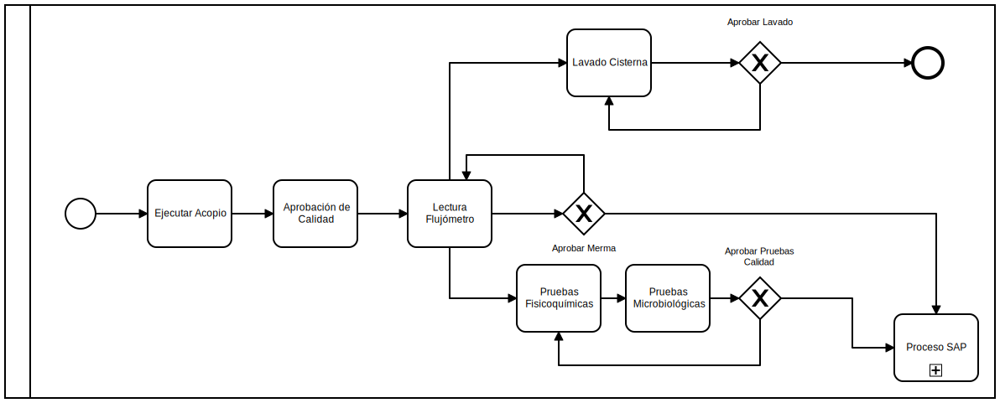
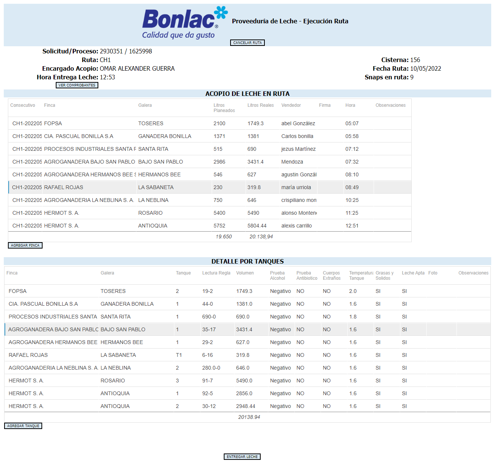
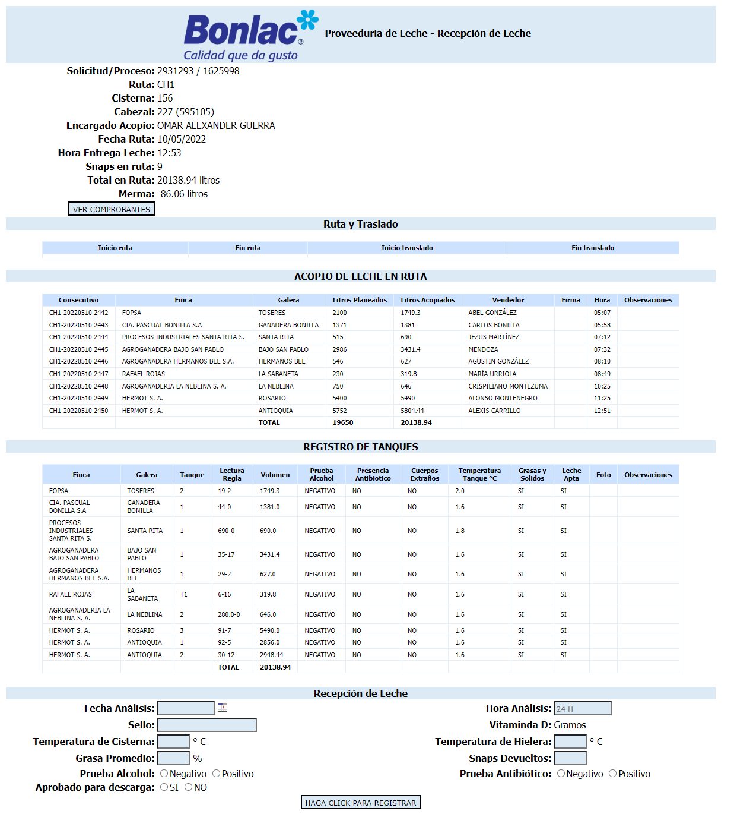
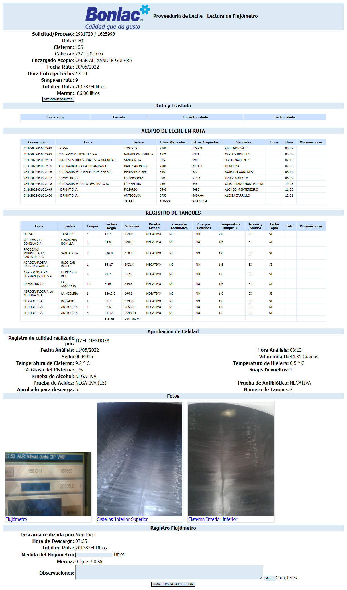
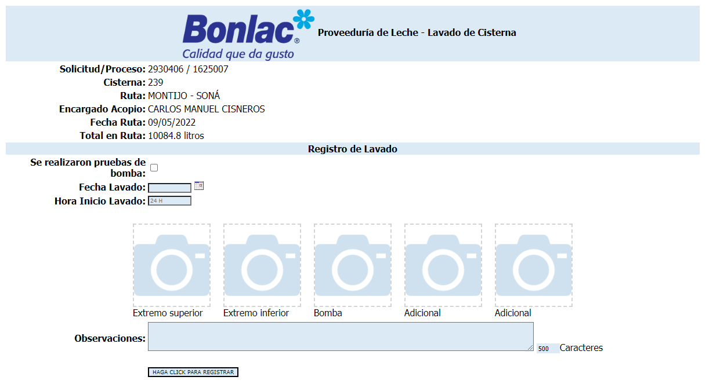
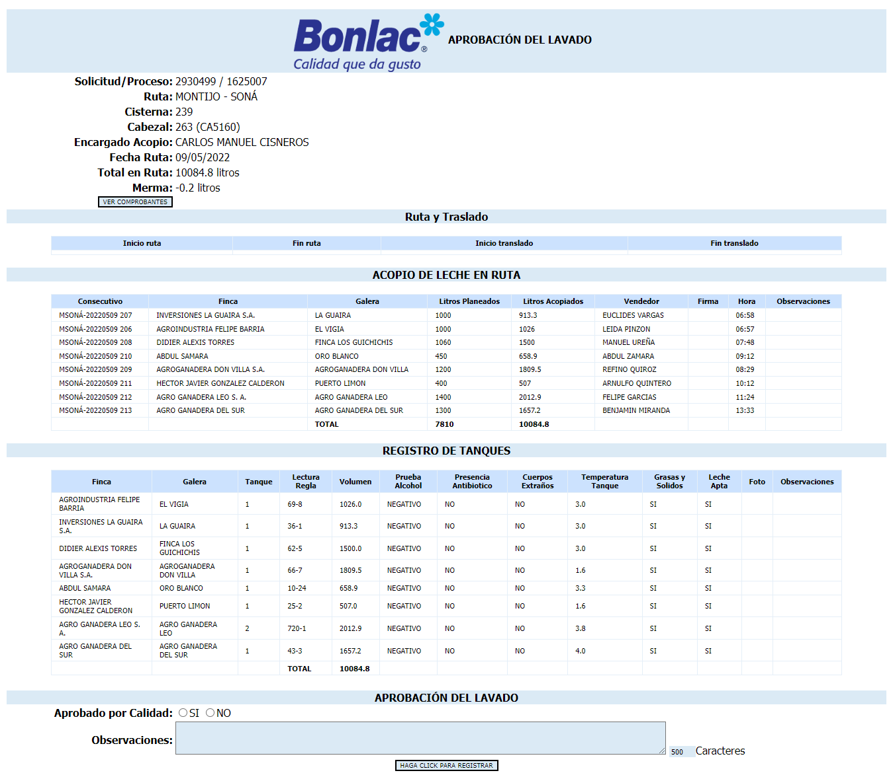
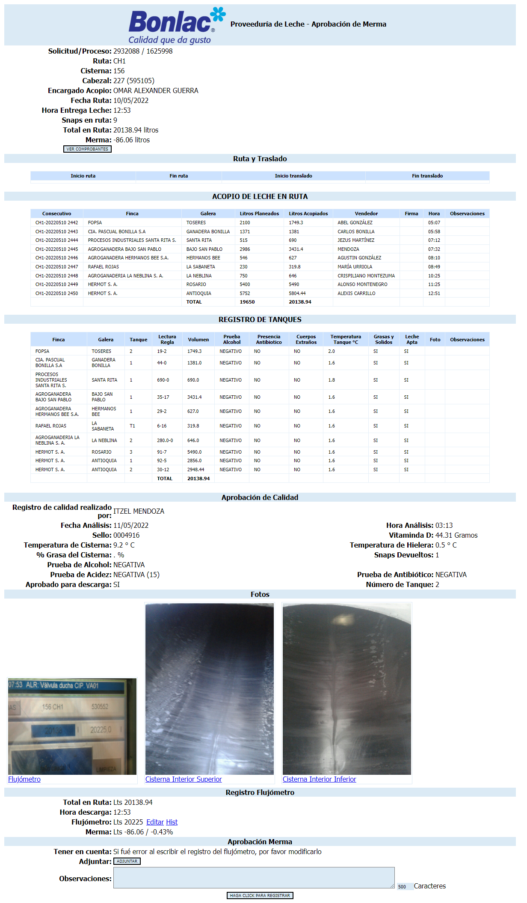
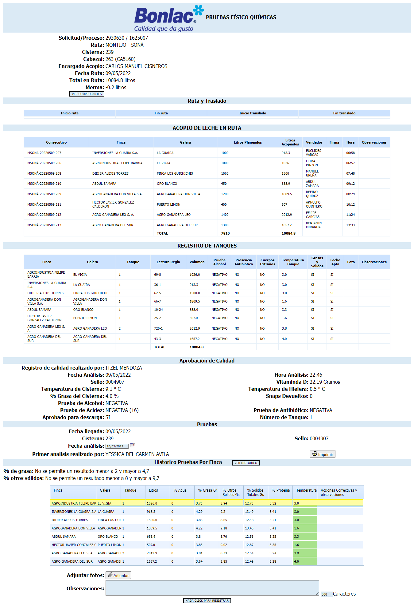
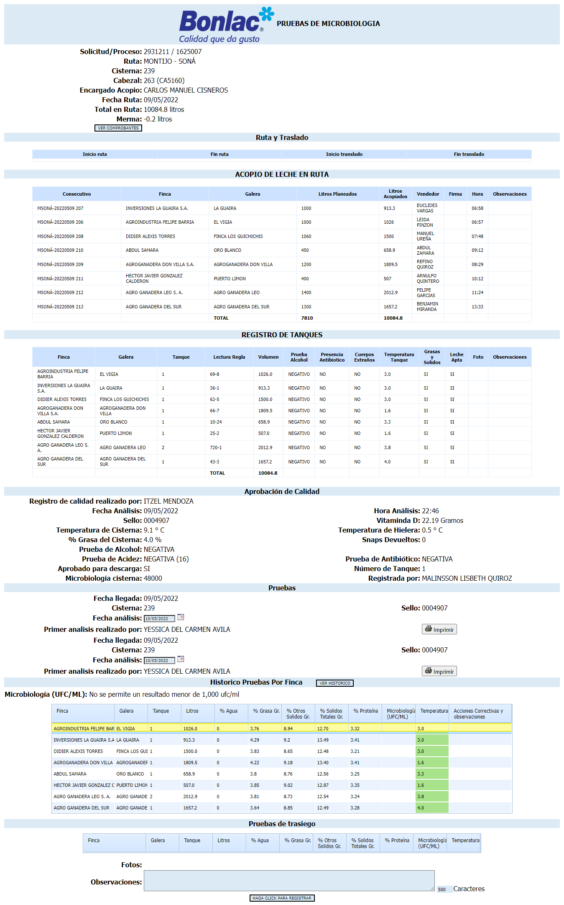
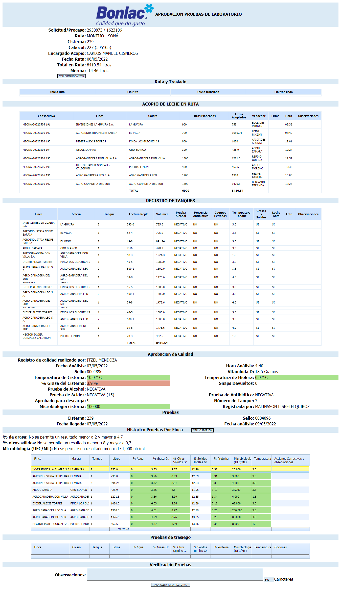

## Descripción del Proceso

Este proceso comprende desde que salen los vehículos a efectuar la recolección de la leche sobre las [rutas](./informacion-general-proveeduria-de-leche.md#rutas) planeadas, hasta que regresan a la planta con la lecha y terminando con el lavado de las [cisternas](./informacion-general-proveeduria-de-leche.md#cisternas) y la etapa de evaluación de las muestras de calidad recogidas en todo el proceso.

*Diagrama de proceso*

***

### Ejecutar Acopio

Inicia con la salida de los vehículos de la planta para ejecutar las [rutas](./informacion-general-proveeduria-de-leche.md#rutas) planeadas, los [conductores](./informacion-general-proveeduria-de-leche.md#conductores) tienen la información de la [ruta](./informacion-general-proveeduria-de-leche.md#rutas) en la ***APP*** con la información de las *[Fincas](./informacion-general-proveeduria-de-leche.md#fincas)*, *Galeras* y *Tanques* donde deben recoger.  

Al momento de llegar a la [finca](./informacion-general-proveeduria-de-leche.md#fincas) primero deben sacar una muestra de leche del tanque he ingresar los datos en la ***APP*** y en caso de encontrar alguna anomalía deben tomar una foto desde la misma aplicación. Para saber la cantidad de leche que se va a recoger en cada tanque, los funcionarios hacen la medición del mismo con una tabla de cubicaje que tiene cada tanque, ingresan los valores en la ***APP*** y esta hace la conversión a litros.  

Luego de haber recogido en todas las [fincas](./informacion-general-proveeduria-de-leche.md#fincas) indicadas el funcionario procede a finalizar la [ruta](./informacion-general-proveeduria-de-leche.md#rutas) desde la aplicación, lo cual genera una tarea para otro funcionario que se encuentra en la planta para que este haga la revisión de los datos que fueron ingresados en el transcurso de la [ruta](./informacion-general-proveeduria-de-leche.md#rutas), y este puede hacer cualquier ajuste en caso de que sea necesario.

*Formulario Ejecutar Acopio*  
 

***

### Aprobación de Calidad

Esta tarea se dispara cuando el funcionario efectuó la revisión de los registros de acopio y aprueba los datos usando el botón **ENTREGAR LECHE** y en ese momento se genera la tarea para un empleado que se encuentra en la planta.  

Los vehículos llegan a la planta y hacen entrega de las muestras que se le hicieron a cada uno de los tanques donde recogieron y se procede a tomar una nueva muestra a cada uno de las *[Cisternas](./informacion-general-proveeduria-de-leche.md#cisternas)*, la información recogida se registra mediante la ***APP***. 

De acuerda a la información obtenida con la prueba, el funcionario determina si aprueba el descargue de la leche y registra en el sistema en que tanque será depositada.

*Formulario Aprobación de Calidad*  

***

### Lectura Flujómetro

Mediante el flujómetro se hace la medición exacta de la cantidad de leche que trae la *[Cisterna](./informacion-general-proveeduria-de-leche.md#cisternas)*. El funcionario encargado de esta tarea debe registrar en el sistema los datos de la cantidad de leche reportado por la [ruta](./informacion-general-proveeduria-de-leche.md#rutas) y la cantidad que registra el flujómetro, la diferencia entre estos dos valores se le denomina ***Merma***, información que se registra en el sistema, si estos valores se encuentran en los rangos establecidos, allí se genera el [proceso SAP](./proceso-sap.md), de lo contrario se dispara la actividad de Aprobación de Merma.    

Los valores registrados por el flujómetro deben ser cargados al sistema mediante una foto por medio de la ***APP***, para que otro funcionario ingrese estos valores vía ***WEB*** de forma manual.

*Formulario Lectura Flujómetro*  

***

### Lavado de Cisterna

Luego de trasladar la leche a los tanques de la planta, la *[Cisterna](./informacion-general-proveeduria-de-leche.md#cisternas)* es lavada y posteriormente pasa una revisión por parte de un funcionario quien determina si puede continuar con una nueva [ruta](./informacion-general-proveeduria-de-leche.md#rutas), en caso contrario se debe repetir el lavado.  

Esta información se registra en el sistema por la **APP** junto con el número del sello que se le coloca a la *[Cisterna](./informacion-general-proveeduria-de-leche.md#cisternas)* y las fotos donde se evidencia el lavado efectuado, este sello sirve para tener el control de la leche y garantizar que la leche de la [cisterna](./informacion-general-proveeduria-de-leche.md#cisternas) no fue alterada.

*Formulario Lavado de Cisterna*  

*Formulario Aprobación Lavado*  

***

### Aprobación de Merma

La empresa cuenta con unos rangos establecidos para determinar el valor aceptable de la ***Merma*** que como se explicó anteriormente es la diferencia entre la cantidad de leche en litros reportado por la [ruta](./informacion-general-proveeduria-de-leche.md#rutas) y el valor arrojado por el *Flujómetro*.   

Esta tarea determina si ese valor se encuentra dentro del rango aceptado, o si por el contrario los valores se salen de los límites establecidos y finalmente si todo es correcto se genera el [proceso SAP](./proceso-sap.md). 

:::info
En esta tarea el funcionario puede hacer los ajustes necesarios en caso de que la ***Merma*** este fuera de los límites, ya que en ocasiones se debe a que ingresan un valor erróneo, para esto el funcionario revisa la foto del *[Flujómetro](#lectura-flujómetro)*, así mismo en ocasiones pueden ingresar los datos de una *[Finca](./informacion-general-proveeduria-de-leche.md#fincas)* diferente.
:::

*Formulario Aprobación de Merma*  

***

### Pruebas Fisicoquímicas

Las pruebas recogidas en el transcurso del proceso son llevadas al laboratorio para hacer una evaluación de la calidad de la leche, con el fin de determinar el valor a pagar por la misma, acuerdo unos estándares ya definidos por la empresa. La información obtenida de las pruebas de laboratorio es cargada en el sistema vía ***WEB*** donde se registra por *Tanque*.

*Formulario Pruebas Fisicoquímicas*  

***

### Pruebas Microbiología

:::caution Precaución
Los resultados tardan de 24 a 48 horas en salir.
:::

Se hace en una tarea independiente debido al tiempo en que tardan en salir los resultados. Hasta que no se tenga el resultado no se puede ingresar la información en el sistema para poder disparar la siguiente tarea.

*Formulario Pruebas Microbiología*  

***

### Aprobación Pruebas de calidad

Esta es una actividad clave, ya que es donde se realizan todos los cálculos de los valores a pagar por la calidad de la leche según el plan de pagos establecido para cada productor y su finalidad es de revisar que todos los valores que se registraron están correctos.

Al activarse esta tarea el funcionario debe revisar la información recibida de las pruebas y determinar si es apto para continuar con el ***[Proceso SAP](./proceso-sap.md)***.

:::info
De acuerdo a la información generada por las pruebas se envía un correo informando el valor a pagar por los litros de leche entregados por la *[Finca](./informacion-general-proveeduria-de-leche.md#fincas))*.
:::

*Formulario Aprobación Pruebas de calidad*  

***

## Update

  <small>
    <i>
      Ultima actualización:
      <b> 11 de mayo de 2022.</b>
    </i>
  </small>

  <small>
    <i>
      Actualizado por:
      <b> Julian A. Ortiz.</b>
    </i>
  </small>

