## Proveeduría de Leche

:::tip
**Empresa:** Bonlac.  
**Nombre Proyecto:** Proveeduría de Leche.  
**Año Implementación:** _2017._  
**Personas de Contacto:**

- Natzare Bermudez - [natzarebermudez@bonlac.com.pa](mailto:natzarebermudez@bonlac.com.pa)
- Milagros Moreno - [milagrosmoreno@bonlac.com.pa](mailto:milagrosmoreno@bonlac.com.pa)
- Evilca Camargo - [evilcacamargo@bonlac.com.pa](mailto:evilcacamargo@bonlac.com.pa)

:::

### Descripción

Este proceso tiene como finalidad el control de la recolección de leche desde su planeación, hasta el pago a los proveedores.

El proceso comienza con la planeación de las cantidades estimadas de leche que se van a recoger el mes siguiente con base a datos históricos con que cuenta la empresa de años anteriores. Esta planeación se divide en **_[Mensual](./planeacion-de-rutas.md#plan-mensual)_**, **_[Semanal](./planeacion-de-rutas.md#plan-mensual)_** y **_[Diario](./planeacion-de-rutas.md#plan-diario)_**.

Para llevar a cabo esta planeación la empresa cuenta con unos **_Datos Maestros_** en los cuales se encuentra la información de las _Rutas_, _Fincas_, _Cisternas_, _Cabezales_ y _Conductores_, además de otra información que no es relevante para el presente documento.

_Diagrama General_
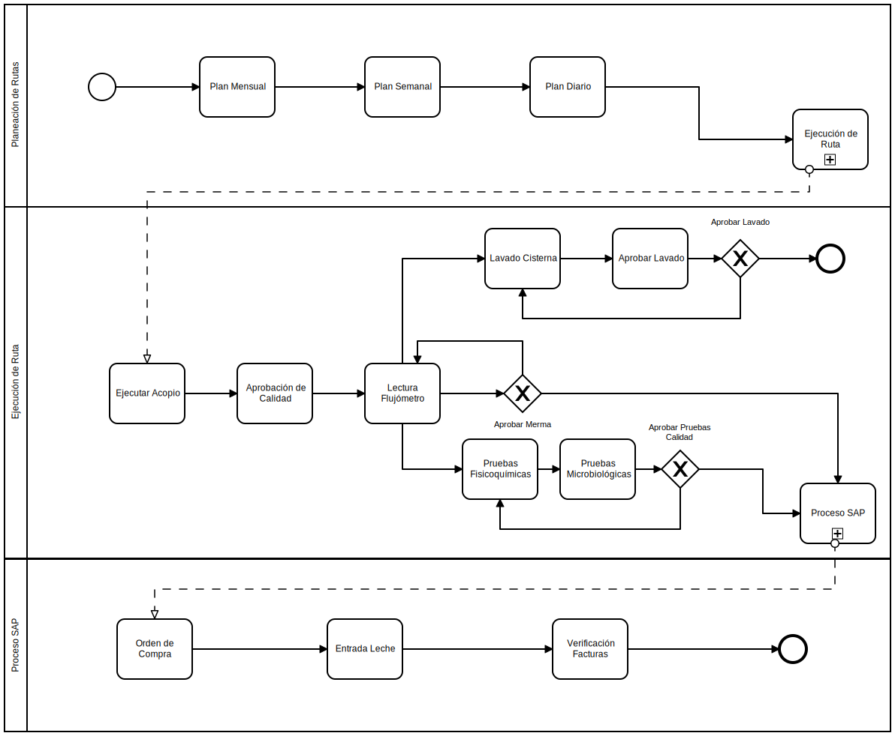

---

### Rutas🏁

Se entiende por _Ruta_ cada uno de los trayectos que se deben recorrer para recoger la leche. Cada una de estas _Rutas_ cuenta con la respectiva nomenclatura para su identificación.

_Ruta Gestionar **Rutas** _  
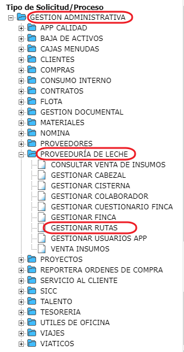

:::info
Para ver los formularios para la gestion de las rutas vaya a **[Ejecución de Rutas](./ejecucion-de-ruta.md)**
:::

---

### Fincas⛺

En la información de las _Fincas_ se encuentra su nombre, código SAP, **_Galeras_**, así como los tanques que se ubican en cada una de las **_Galeras_**.

:::tip
**_Galera_** es una división interna de cada finca similar a una parcela. 🌳
:::

_Ruta Gestionar **Fincas** _  
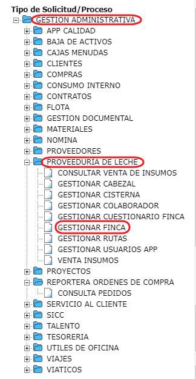

_Formulario Gestionar Finca_  
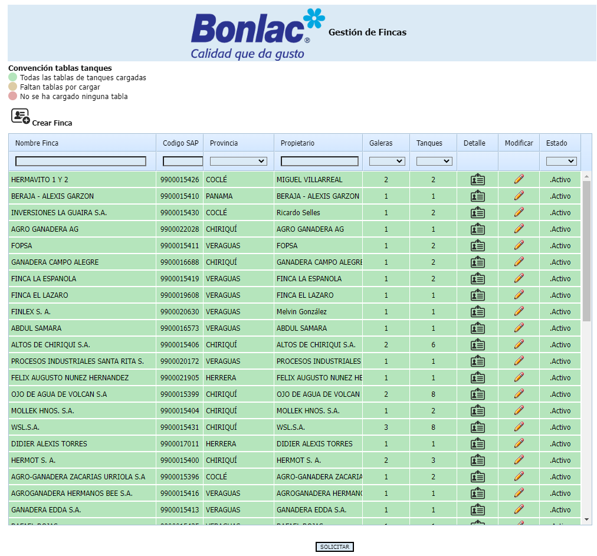  
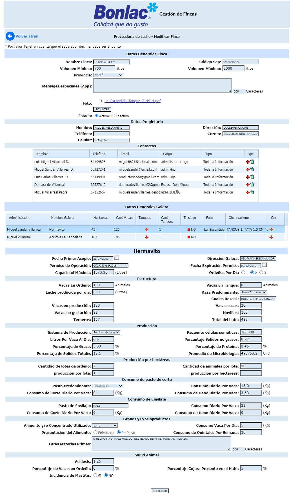

---

### Cisternas🚃

Son los tanques donde se transporta la leche, los cuales cuentan con sus especificaciones técnicas, así como su identificación junto con otra información que no es relevante para el presente documento.

_Ruta Gestionar **Cisternas** _  

_Formulario Gestionar **Cisternas** _  
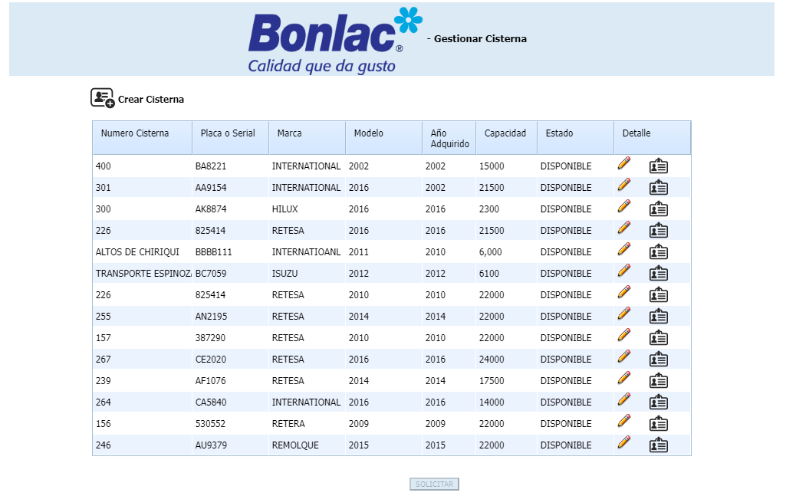  
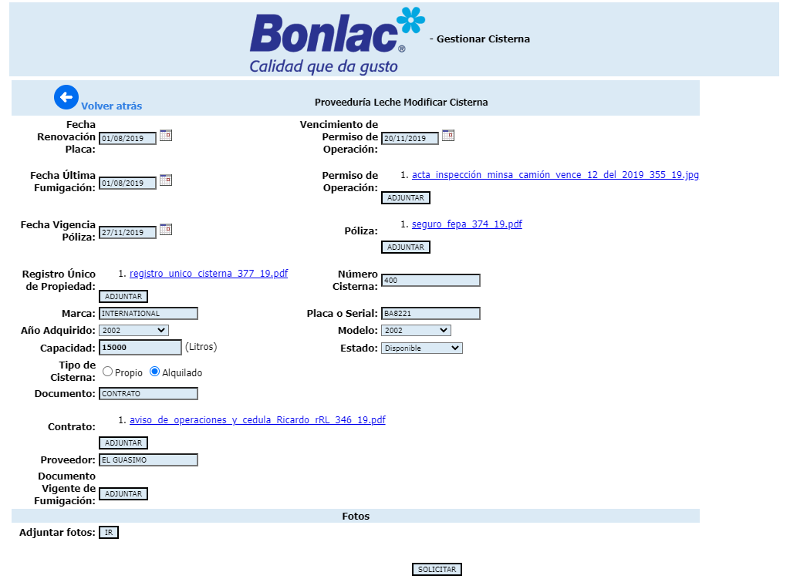

---

### Cabezales🚛

Hace referencia a los vehículos que llevan las **_Cisternas_**.

_Ruta Gestionar **Cabezales** _  
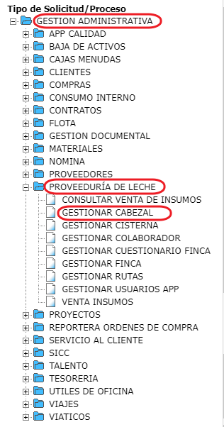

_Formulario Gestionar **Cabezales** _  
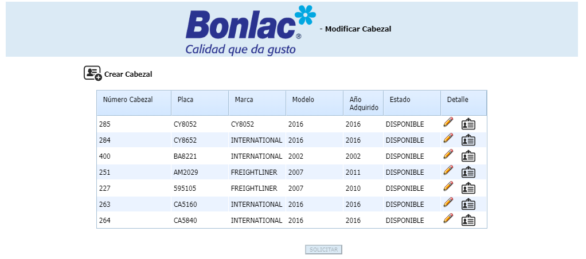  
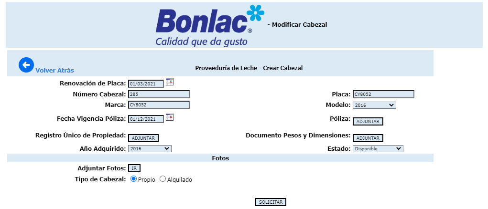

---

### Conductores👷

Se refiere a la tripulación que se encarga de hacer la operación de recolección de la leche hasta entregarla en la planta, y se dividen en **_Acopio_**, **_Traslado_** y **_Trasiego_**.

- **Acopio:**  
   Son los empleados que llegan hasta las fincas para recoger la leche.

- **Traslado:**  
   Es el empleado encargado de llevar el vehículo con la leche que se recogió, desde un punto determinado hasta la planta. Por lo general el **_Acopio_** lleva el vehículo hasta este punto luego de recoger la leche en las fincas y allí hacen cambio de vehículo con el **_Traslado_**, para que este la lleve a su destino final en la planta.

- **Trasiego:**  
   Se encarga de recoger la leche en fincas de difícil acceso, para luego trasegarla al vehículo de **_Acopio_**.

_Ruta Gestionar **Conductores** _  
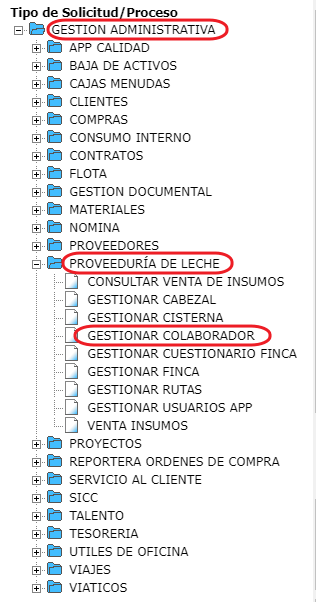

_Formulario Gestionar **Conductores** _  
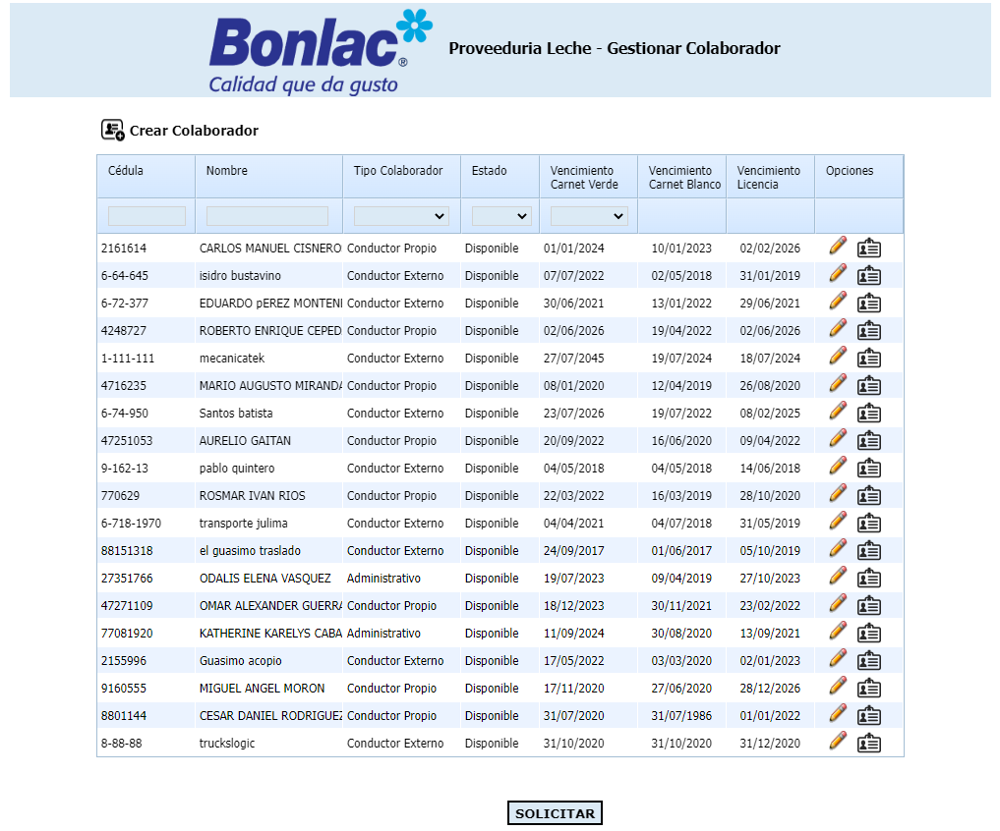  
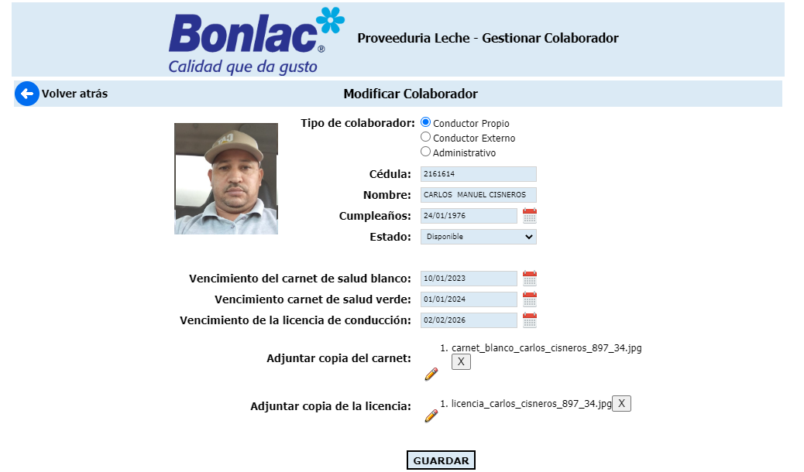

---

## Update

  <small>
    <i>
      Ultima actualización:
      <b> 11 de mayo de 2022.</b>
    </i>
  </small>

  <small>
    <i>
      Actualizado por:
      <b> Julian A. Ortiz.</b>
    </i>
  </small>

