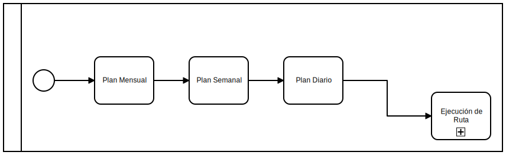
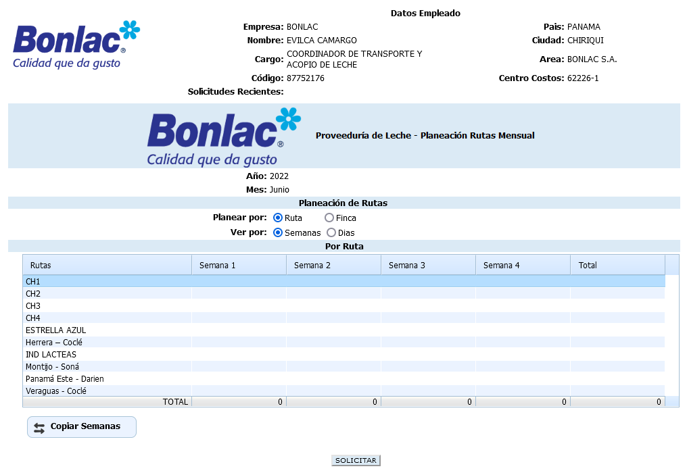
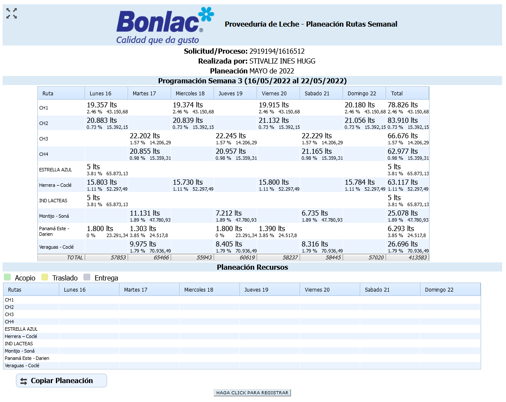
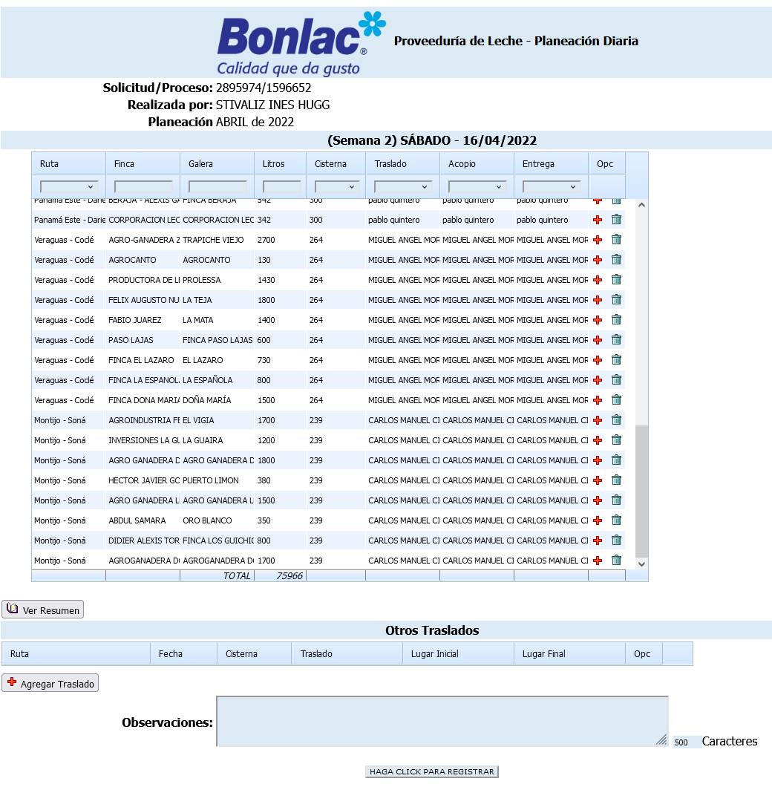

## Descripción del Proceso

La esencia de este proceso es tener la estimación de leche que se va a recoger durante todo el mes.

*Diagrama de proceso*

Este proceso comprende la etapa de planeamiento y se divide en tres partes:

- Plan Mensual.  
- Plan Semanal.
- Plan Diario. 

***

### Plan Mensual

:::info
Esta tarea se inicia de forma manual por el usuario.
:::

La tarea tiene como finalidad hacer el planeamiento operacional para las [rutas](./informacion-general-proveeduria-de-leche.md#rutas) encargadas de recoger la leche en las diferentes [fincas](./informacion-general-proveeduria-de-leche.md#fincas) que proveen a la empresa.

Se registran cuales son las *[rutas](./informacion-general-proveeduria-de-leche.md#rutas)* que se van recorrer cada semana del mes siguiente, las [fincas](./informacion-general-proveeduria-de-leche.md#fincas) que se van a visitar y los litros que se van a recoger en cada una de las *Galeras*.

:::caution Precaución
Esta terea se encuentra activa hasta el último día del mes anterior al mes planeado. Por ejemplo, si se efectúa la planeación del mes de ***Marzo***, esta solo se encuentra disponible hasta el día *28* del mes de ***Febrero***.
:::

:::danger Importante
Esta es una causal de soporte frecuente, ya que el funcionario encargado deja pasar la fecha límite para diligenciar la información y el sistema cierra la tarea.
:::  

*Formulario PLan Mensual*  

***

### Plan Semanal

:::info
Esta tarea se inicia de forma automática por el sistema y se lanza luego de registrar toda la información en la tarea del ***[Plan Mensual](#plan-mensual)***.  

Por ejemplo, para el mes de mayo de 2022 se generan las tareas para las semanas así:
-	**Semana 1:** viernes 6 de mayo al jueves 12 de mayo.
-	**Semana 2:** viernes 13 de mayo al jueves 19 de mayo.
-	**Semana 3:** viernes 20 de mayo al jueves 26 de mayo.
-	**Semana 4:** viernes 27 de mayo al jueves 02 de junio.

:::

Para esta terea ya se cuenta con la información de las [rutas](./informacion-general-proveeduria-de-leche.md#rutas), así como de cuanta leche se espera recoger ya que lo trae de la tarea anterior, pero el funcionario puede hacer los ajustes necesarios dada las circunstancias. El funcionario debe ingresar la información de las ***[Cisternas](./informacion-general-proveeduria-de-leche.md#cisternas)***, ***[Cabezales](./informacion-general-proveeduria-de-leche.md#cabezales)***, y ***[Conductores](./informacion-general-proveeduria-de-leche.md#conductores)***, por último, al momento de guardar la información se disparan las ***Planeaciones Diarias***.

:::caution Precaución
El usuario puede hacer múltiples modificaciones hasta que se cierra la tarea el día jueves a las ***12:00***.
:::

En este formulario se registra la información de manera semanal, por ejemplo, del viernes 13 de marzo de 2022 hasta el jueves 19 de marzo de 2022 y la tarea queda en la bandeja de pendientes de la persona que realizó la [planeación mensual](#plan-mensual).

*Formulario Plan Semanal*  

***

### Plan Diario

En este punto se recibe toda la información de las tereas anteriores y se divide en siete tereas, una por cada día de la semana.

:::info
Esta tarea se inicia de forma automática por el sistema y se lanza luego de registrar toda la información en la tarea del ***[Plan Semanal](#plan-semanal)***.  

Por ejemplo, para la **Semana 1** de mayo de 2022 se generar las tareas diarias así:
-	**Día 1:** viernes 6 de mayo.
-	**Día 2:** sábado 7 de mayo.
-	**Día 3:** domingo 8 de mayo.
-	**Día 4:** lunes 9 de mayo.
-	**Día 5:** martes 10 de mayo.
-	**Día 6:** miércoles 11 de mayo.
-	**Día 7:** jueves 12 de mayo.

:::

:::caution Precaución
Esta terea se encuentra activa hasta las ***23:00*** de cada día.
:::

En este formulario se registra la información de manera diaria, esto quiere decir que es un formulario por cada día de la semana, allí se pueden modificar los litros, los encargados y se pueden agregar nuevas [rutas](./informacion-general-proveeduria-de-leche.md#rutas). De igual manera esta tarea queda en la bandeja de pendientes de la persona que realizó la planeación.

:::tip
Luego de cerrarse la tarea, el sistema cuenta con un ***botón*** para abrirla nuevamente en caso de ser requerido.
::: 

*Formulario Plan Diario*  

***

## Update

  <small>
    <i>
      Ultima actualización:
      <b> 10 de mayo de 2022.</b>
    </i>
  </small>

  <small>
    <i>
      Actualizado por:
      <b> Julian A. Ortiz.</b>
    </i>
  </small>

