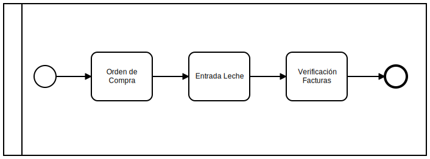
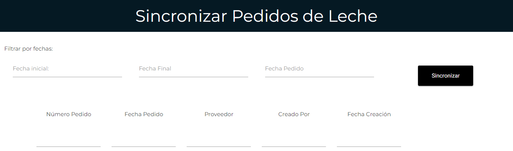
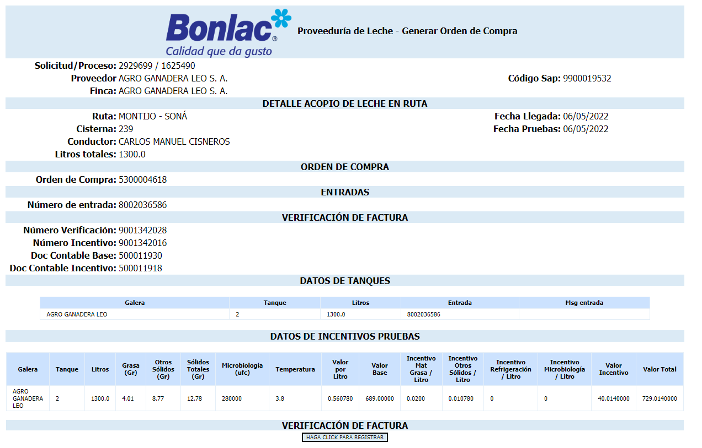
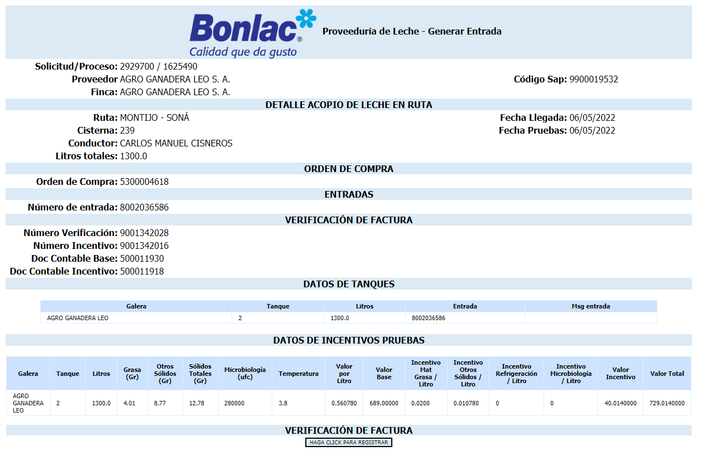
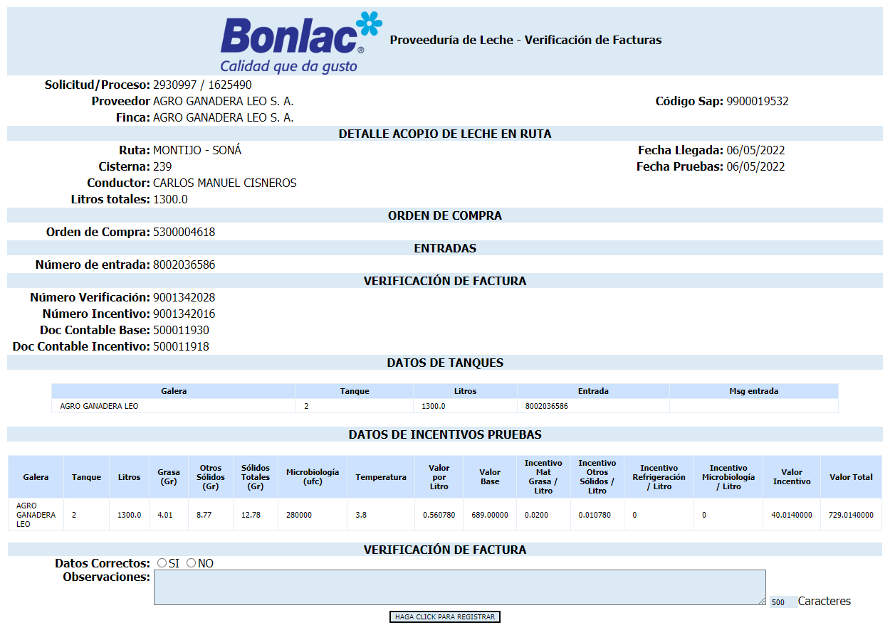

## Descripción del Proceso

Este proceso mantiene el inventario de Leche actualizado en SAP y crea las cuentas por pagar para los productores, se generan procesos por cada proveedor al que acopiaron leche en la [ruta](./informacion-general-proveeduria-de-leche.md#rutas).

*Diagrama de proceso*

:::danger Importante
Todas estas actividades son registradas por el sistema de manera automática.  

Solo se debe tener intervención de un usuario si se genera algún tipo de error al momento de llevar los datos a SAP.
:::

***

### Orden de Compra

Cada mes la empresa crea una orden de compra para cada [finca](./informacion-general-proveeduria-de-leche.md#fincas)) con su número de SAP como proveedor de forma manual por medio de SAP, basados en los datos históricos del mes al que se va a generar la orden de compra, por ejemplo, si se va a crear la orden de compra para el mes de marzo de 2022 se basan en el registro del mes de marzo del año anterior, de esta manera generan la orden de compra según la cantidad de leche que produjo esta [finca](./informacion-general-proveeduria-de-leche.md#fincas)) en el año anterior.  

El sistema cuenta con un módulo para sincronizar los pedidos de Leche, como se muestra en la siguiente imagen.

*Formulario Sincronizar Pedidos de Leche*

:::info
La tarea de manera automática busca la orden de comprar según la [finca](./informacion-general-proveeduria-de-leche.md#fincas)).
:::

*Formulario Orden de Compra*

***

### Entrada de Leche

Con el numero de la orden de compra obtenido en la tarea anterior se genera esta tarea la cual compara la cantidad esperada de leche que iba a entrar acuerdo la orden de compra con la cantidad real que ingreso acuerdo la *Lectura Flujómetro* y hace la actualización de los valores en el inventario en ***SAP***.

:::info
Esta tarea se hace por ***Tanque*** a diferencia de la tarea anterior que se hace por ***[Finca](./informacion-general-proveeduria-de-leche.md)***.
:::

Cuando finalizan todas las entradas de leche de una [ruta](./informacion-general-proveeduria-de-leche.md#rutas), se efectúa la salida por merma, con la cantidad de litros que se calcularon entre lo acopiado y lo registrado por el flujómetro, así en SAP queda el inventario real de leche

:::info
El registro se hace de manera automática en SAP con la cantidad total de litros recogidos en la [Finca](./informacion-general-proveeduria-de-leche.md#fincas)) .
:::

*Formulario Entrada de Leche*

***

### Verificación de Facturas

El sistema lleva la información a SAP de los incentivos para cada [finca](./informacion-general-proveeduria-de-leche.md#fincas)) basados en los resultados de las ***[Pruebas Físico químicas](./ejecucion-de-ruta.md)*** y ***[Prueba de Microbiología](./ejecucion-de-ruta.md)*** que determinan el nivel de calidad de la leche y genera unos documentos de contabilización.

*Formulario Verificación de Facturas*

***

## Update

  <small>
    <i>
      Ultima actualización:
      <b> 11 de mayo de 2022.</b>
    </i>
  </small>

  <small>
    <i>
      Actualizado por:
      <b> Julian A. Ortiz.</b>
    </i>
  </small>

