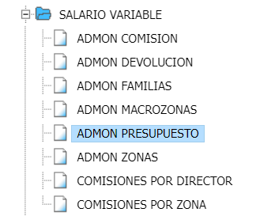
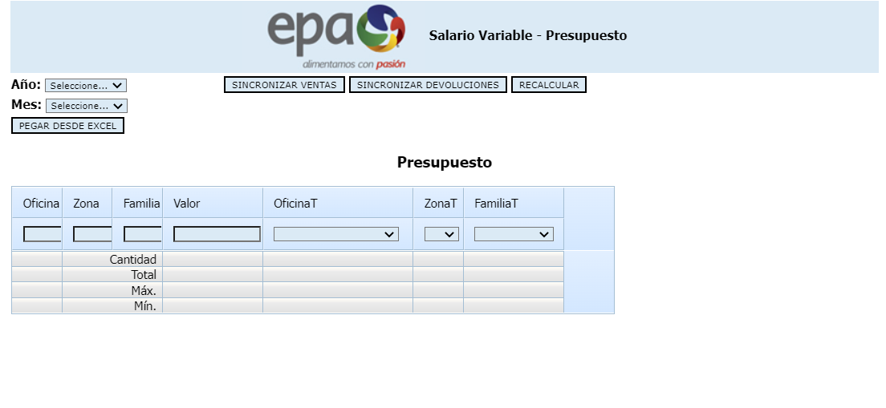

## General

### Ventas

El proceso inicia con el cargue de las ventas desde SAP que se hace en el formulario de Presupuesto.
Las ventas se cargan y se agrupa el monto por año, mes, organización de ventas, grupo de materiales (para identificar posteriormente la familia de productos) y zona de ventas (para identificar el vendedor).

_Árbol Inicio_  

_Formulario Inicial_  

### Devoluciones

Después se cargan las devoluciones desde SAP, también en el formulario de Presupuesto.
Las devoluciones se cargan y agrupa el monto por año, mes, canal, grupo de comisión (para identificar la familia de productos), la zona (para identificar el vendedor) y sólo se tienen en cuenta algunas devoluciones (que sean atribuibles a la labor del vendedor).

### Presupuesto

Posteriormente se carga el presupuesto de ventas por familia, que son las metas que el vendedor debe cumplir, el porcentaje de cumplimiento de estas metas son la base principal para el cálculo del salario variable del vendedor.
Cálculo de la comisión

Una vez se han cargado las ventas, las devoluciones y el presupuesto se hace el cálculo del salario variable para las zonas y las macrozonas.

### Zonas

Las zonas son el conjunto de clientes que un vendedor debe visitar (también conocidas como rutas) y las macrozonas son el conjunto de zonas que están a cargo de un jefe de ventas.

Cuando se realiza el cálculo de la comisión se hace a la zona y no al vendedor, pues este se debe asignar al iniciar el proceso de aprobación de la comisión pues la asignación de los vendedores y ayudantes por zona se va ajustando de acuerdo a las necesidades de la compañía.

### Macrozonas

Las zonas que componen una macrozona y el encargado (que recibirá la comisión) están parametrizadas en el sistema.
El cálculo de la comisión de la macrozona, se hace teniendo en cuenta las ventas, las devoluciones, etc. de las zonas que la componen.

## Cálculo de la comisión

Una vez se han cargado las ventas, las devoluciones y el presupuesto se hace el cálculo del salario variable para las zonas y las macrozonas.

### Zonas

Las zonas son el conjunto de clientes que un vendedor debe visitar (también conocidas como rutas) y las macrozonas son el conjunto de zonas que están a cargo de un jefe de ventas.

Cuando se realiza el cálculo de la comisión se hace a la zona y no al vendedor, pues este se debe asignar al iniciar el proceso de aprobación de la comisión pues la asignación de los vendedores y ayudantes por zona se va ajustando de acuerdo a las necesidades de la compañía.

### Macrozonas

Las zonas que componen una macrozona y el encargado (que recibirá la comisión) están parametrizadas en el sistema.
El cálculo de la comisión de la macrozona, se hace teniendo en cuenta las ventas, las devoluciones, etc. de las zonas que la componen.

## Update

  <small>
    <i>
      Ultima actualización:
      <b> 01 de agosto de 2022.</b>
    </i>
  </small>

  <small>
    <i>
      Actualizado por:
      <b> Juan C. González.</b>
    </i>
  </small>

