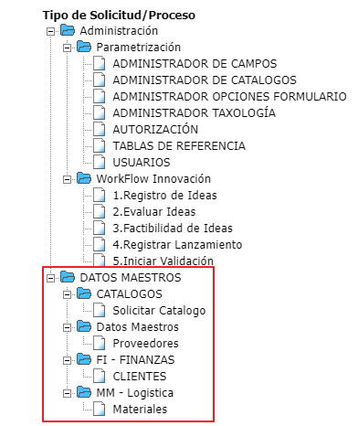

## Datos Maestros

:::tip
**Empresa:** Inversiones Centro Americanas.  
**Nombre Proyecto:** Datos Maestros.  
**Año Implementación:** _Pendiente._  
**Personas de Contacto:**

- Pendiente - [Pendiente](mailto:vmorales@casaluker.com.co)

:::

### Descripción

Este proceso tiene como finalidad el manejo de información y su integración con SAP en cuanto a tres aspectos operacionales de la empresa, los cuales son **_Proveedores_**, **_Clientes_** y **_Materiales_**.

Su implementación se baso en los procesos que se llevan para **_[Valorem](informacion-general-datos-maestros)_** con algunas mejoras y modificaciones que se abordaran más adelante, pero en cuanto a concepto se mantiene la misma filosofía.

_Vista Árbol de Procesos_  

  <small>
    <i>
      Ultima actualización:
      <b> 04 de Agosto de 2022.</b>
    </i>
  </small>

  <small>
    <i>
      Actualizado por:
      <b> Julian A. Ortiz.</b>
    </i>
  </small>

