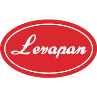

:::tip
**Ubicación:** Colombia.  
**Sitio web:** [www.levapan.com](https://www.levapan.com/)      
**Sector:** Servicios de alimentos y bebidas.   
**Fundación:** 1953.  
**Sitio de Procesos:** [procesos.levapan.com](http://procesos.levapan.com)  
**Cliente desde:** 2010.  
**Contacto TI:** Wilson Perez - [wilson.perez@levapan.com](mailto:wilson.perez@levapan.com)  
**Contacto FUncional:** Fanny Parra - [fanny.parra@levapan.com](mailto:fanny.parra@levapan.com)  
**Contacto Administrativo/Comercial:** Maritza Rodriguez -[maritza.rodriguez@levapan.com](mailto:maritza.rodriguez@levapan.com)
:::

***

## Resumen

Somos una empresa multilatina de origen colombiano fundada en el año 1956. Nos especializamos en la producción y comercialización de levadura, extractos de levadura, potenciadores de sabor; materias primas para la industria de alimentos, panadería y repostería, productos de consumo masivo, gastronomía, agroindustria, proteínas vegetal y animal. Tenemos presencia en varios países: Colombia, Ecuador, Venezuela, Perú, República Dominicana y Panamá. Actualmente trabajamos con el propósito de enfrentar y asumir un mercado cada vez más competitivo.

***

## Update

  <small>
    <i>
      Ultima actualización:
      <b> 10 de mayo de 2022.</b>
    </i>
  </small>

  <small>
    <i>
      Actualizado por:
      <b> Julian A. Ortiz.</b>
    </i>
  </small>

