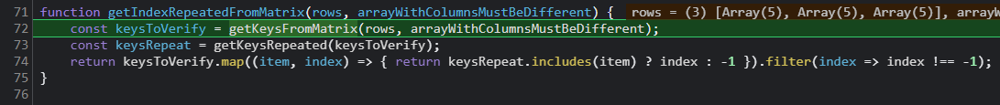
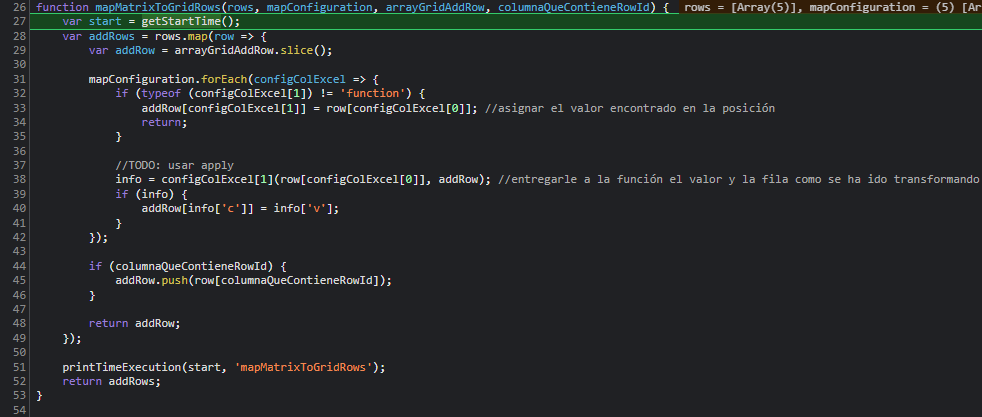
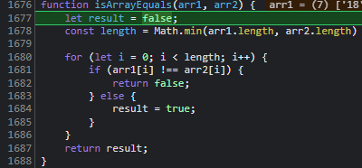
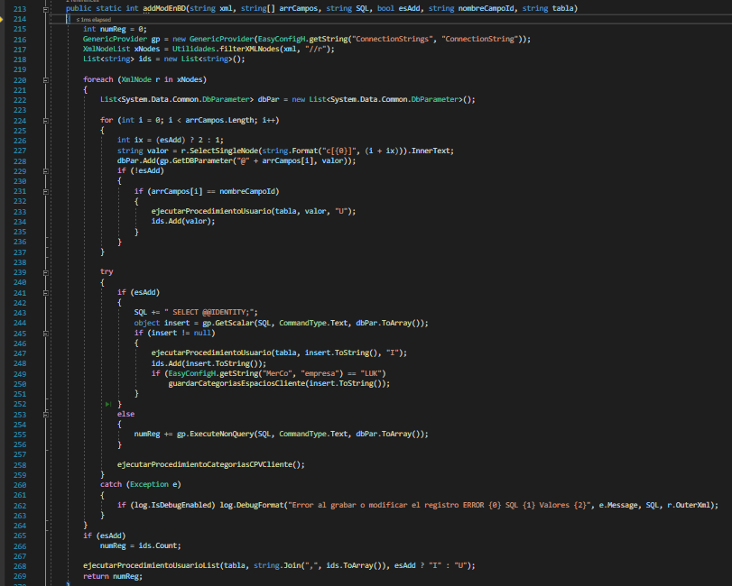
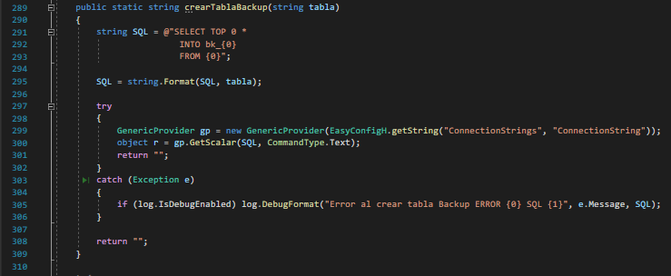

<h1>DOCUMENTACIÓN MÓDULO 44</h1>

<h2>ADMINISTRADOR DE DATOS</h2>

En el administrador de datos tenemos varios métodos/acciones en común, los cuales son:

- [Refrescar](#_heading=h.gy8s5xwbwdd8)
- [Descargar](#_heading=h.n1w7gfregegu)
- [Agregar](#_heading=h.kvvew695cilb)
- [Pegar](#_heading=h.7dn50bkmwlpo)
- [Actualizado Masivo ](#_heading=h.criedvgn21ws)
- [Borrar](#_heading=h.joemwinsufa2)
- [Borrado Masivo](#_heading=h.7wusr94fx2z)
- [Grabar](#_heading=h.l9rprp5twpft)

No todas las tablas usan los mismos módulos:

Hay tablas que no permiten el borrado:

`	`- usuarios

`	`- productos

`	`- categorías

Veamos el flujo que sigue cada una de estos métodos

# NOTA:
- Leer la información que se tiene en el archivo adminTablasConfJGB.js, esto nos ayudará a entender la estructura de las tablas/grid
- ITEM SON LOS VALORES DE LA FILA E INDEX ES LA POSICIÓN DE LA FILA
- ROW ES TODA LA INFORMACIÓN QUE INGRESAMOS EN EL MODAL, ES DECIR, LA QUE PEGAMOS DE EXCEL. 
- KEY ES EL CAMPO UNICO QUE SE TIENE, ES DECIR EL NOMBRE DE LA COLUMNA ÚNICA QUE SE TENGA DEPENDIENDO LA TABLA, 
- GRID ES LA TABLA QUE SE TIENE EN LA VISTA WEB.
- gAdmin tiene toda la data de la grid
- La llave es el campo de la tabla con la que se está enlazando
- El valor del campo es el valor que se mostrará en la grid
- Cuando tenemos el llamado a un método antecedido por gAdmin estamos llamando un método dhtmlx

# REFRESCAR
Cuando clickeamos el botón de refrescar, llamamos la función de 
## refrescarAdminTabla()

La cual a su vez nos llama dos funciones más [getDatosAdminTabla](#_heading=h.bac4pxctdsad)[()](#_heading=h.bac4pxctdsad) y[limpiarTodoBD()](#_heading=h.57eyaoni24yg)
### getDatosAdminTabla()

Primero le agregamos una propiedad css al elemento html \_carg

Limpiamos gAdmin es decir a la grid

Luego llamamos la función [actualizarNRegistros](#_heading=h.yqcgps3wmw1b)(), básicamente llamamos el método htmlx de	getRowsNum que nos obtiene la cantidad de filas que hay en la grid y lo actualizamos en el html

Después llamamos el método [getDatosTablaAdmin](#_heading=h.9dkh7a8p46be)()(BACKEND) y le enviamos como 	 	parámetros

El nombre de la tabla en la base de datos

Los campos que obtendremos de esa tabla

Las funciones predefinidas para realizar select en la consulta sql del backend

El where que en caso que se nulo lo enviaremos vacío (‘ ’)

El order by que en caso que se nulo lo enviaremos vacío (‘ ’)

El join que en caso que se nulo lo enviaremos vacío (‘ ’)

Una función la cual agrega una propiedad css a \_carg , también cortará la ejecución en caso que data no tenga datos, si no parseamos esta data

actualizamos los números de registros llamando la función [actualizarNRegistros](#_heading=h.yqcgps3wmw1b)()

### limpiarTodoBD()

Esta función nos ‘resetea’ el valor 

del objeto de la estadística, 

al igual que el objeto de la filas modificadas, 

el array de filas borradas, 

Nos desactiva el botón de ok (\_btnOk)

Ocultamos el botón de no pegar

rN rM rB son en el html la rueda de carga, a esos le definimos ese classname que es el css de la rueda de carga (N=nueva, M=modificada, B=borrada)

Dejamos vacío rSpan que es el campo html donde se muestra el mensaje

mandamos 0 al número de registros que corresponde al que se muestra en el html

Y finalmente limpiamos los filtros

# DESCARGAR
Cuando clickeamos el boton de descargar este nos va a disparar la función de 
## descargarExcel()

Inicialmente creamos un id para este documento el cual será el valor que nos retorne new date

Después generamos el nombre el cual será la tabla en la cual nos encontremos más los primero 4 digitos que generamos en el id

Definimos una variable ridN la cual nos almacenara el id de la row

Tenemos un condicional donde validamos si el id del documento es igual a valor de  ‘\_ejemplo’ (este se da cuando descargamos el excel desde el modal de actualizar masivo)

Si este se cumple

validaremos con getRowsNum que la cantidad de filas sea igual a 0, en caso de ser así 

llamaremos la función [addNuevaFila](#_heading=h.rw50r37fy5hc)(), la cual nos crea la nueva fila en la grid y le asigna un id el	cual nos retorna

Tenemos segundo condicional, el cual se ejecutará siempre y cuando el número de filas en la grid sea mayor a 0, 

si esto se cumple,

` `llamaremos la función generarExcelGrid(), la cual como su nombre lo dice nos generara el excel. 

Finalmente tenemos un tercer condicional con la primera condición, donde se nos eliminará la fila que se creó inicialmente.
# AGREGAR
Cuando clickeamos el botón correspondiente a agregar, este dispara la función de
## addNuevaFilaE()

La cual simplemente nos invoca la función de 
### addNuevaFila()

El cual nos instanciara primeramente el id de esta nueva fila en newId, este guarda la fecha actual.

Seguidamente validamos que el addRow que recibimos por parámetros tenga algún dato,

en caso que no sea así.

Crearemos una nueva fila llamando el método addRow y le enviamos , 

\-	el newId que definimos con anterioridad, 

\-	el valor que nos contenga el OBJETO cfgAdminGrid en el subindice arrAddRow la cual en este momento está vacía ya que no hemos ingreso aún datos y por defecto arrAddRow es definido como un array vacío.

En caso que estuviese algo 

definido dentro de addRow, de igual forma crearemos la nueva fila, pero en el segundo parámetro enviamos el addRow que se nos envía por parámetros

Esta función nos retornará el newId.

Después de esto deberemos ingresar datos a cada campo y clickeamos GRABAR, el cual veremos más adelante.

# PEGAR
Una vez damos click en el botón de pegar, este invocará la función 
## verDvPExcelE()

El cual nos invoca la función de verDvExcel() y le enviamos e.data.ver el cual nos devuelve un true

### verDvExcel()

En esta función llamamos [setDisplayElements](#_heading=h.q8dqmy1idrfs)() que lo que hace como su nombre lo dice, envia los elementos visuales, es decir, esta función nos disparara el modal donde pegaremos los datos

Tenemos un condicional en caso de que no se nos envíe el parámetro ver, es decir, sea null, undefined, empty. Nos devolverá un false	

Después tendremos el cuadro donde insertaremos los datos correspondientes.

-- Este es un ejemplo del administrador de datos en el apartado de productos --

Después de ingresar los datos, clickeamos en pegar datos el cual disparará la función:
## pegarExcel()

Primero daremos la propiedad de disable true para mostrar el modal \_pExcel

Seguidamente almacenaremos en confCols la configuración de la configuración de la tabla la cual la tenemos en adminTablasConfJGB.js, esto lo convertimos en un array teniendo como base la tabla que estamos haciendo referencia, esto usando la función [convertConfigurationToArray](#_heading=h.pentvlrk114g)()

En confColsExcel tomamos la configuracion de la tabla que guardamos anteriormente en confCols filtrando y creando un array donde guardará la configuración de las columnas que estemos ingresando en lo que pegamos anteriormente, siempre que usemos pegar el campo id de la tabla será null, debido a que el id se genera de manera automática.

En rows llamaremos la función [getMatrixFromTextPasteFromExcel](#_heading=h.rg6fu4dc7w1w)(), y le enviaremos  dos parámetros, el primero, es equivalente al texto que pegamos anteriormente y el segundo parámetro es la cantidad de columnas que ingresamos, tomando como referencia el tamaño de confColsExcel este se encuentra en Excel3Grid.js , esta función nos devolverá un array con los datos del excel separados por filas y columnas

Depues tenemo un condicional al cual se entrará en caso de que no hayan filas, es decir, que no hayamos ingresado ningún dato, 

en ese caso, nos enviará false a verDvPExcel el cual vimos anteriormente y es el que nos 	muestra el modal, también nos mandara false al disable al elemento html del modal donde pegamos los datos

En indexRepeated, llamamos la funcion [getIndexRepeatedInRows](#_heading=h.x0ulyxamfoq3)() y enviamos como parámetro rows, esta función nos retornara el valor del campo único de las filas repetidas.

En la constante de rowsRepeated, el cual nos llama la función de [getRowsrepeated](#_heading=h.j2w5r4qnghcs)() y le enviamos la data de rows y los índices de las filas repetidas. Este nos devolverá el índice de la fila que se está repitiendo

continuamos con la reasignación de rows, donde llamaremos la función [getRowsWithoutRepeated](#_heading=h.jqza24f6pr0j)() y le enviamos  rows e indexRepeated, esta función nos retornara el id de las filas que no están repetidas

En la constante confMap la cual llama la función de [prepareConfigToMapMatrixToGridRows](#_heading=h.wux41de72wpm)() y le enviamos como parámetros la constante de confCols(configuracion columnas de la grid) y confColsExcel(configuracion columnas de los datos que pegamos), esta función nos retornara un array de la posición de las columnas, donde el primer elemento es la posición de la columna de los datos que pegamos y el segundo elemento es la posición de la columna en la grid.

continuamos con  la reasignación de rows, donde llamamos la función de [mapMatrixToGridRows](#_heading=h.68n9p9s8aoy5)(), y le enviamos el valor actual de rows, confMap que es un arreglo con los índices de la columna única, que tomamos de los valores que pegamos y la grid,  cfgAdminGrid.arrAddRow que nos envia un array que contiene tantos espacios vacíos como columnas tenga nuestra tabla y en la primera posición del arreglo [0] tendremos un ‘#’ ya que este campo siempre será del id que nos da el sistema.

en rIdsPegados llamamos la funcion [fillGridFromGridRows](#_heading=h.w9mwnz1504es)() esta nos retornara los ids nuevos que se agregaron a la grid

En la función principal

Tenemos un condicional el cual ya no se utiliza en el flujo debido a que solo se llamaba en pegarExcel pero esta fue refactorizada

Después mostramos el modal de los ids repetidos con la función [showRepeateds](#_heading=h.7x80grggci5v)()

Cambiamos el valor del excel a vacío

Le mandamos el false al modal del excel

# ACTUALIZADO MASIVO 
Al momento de clickar actualizado masivo, se nos llamara la función 
## verDvPExcelEA()

` `le enviamos la en parámetros los modales que este desplegara y el tipo que es, en el caso de actualizar masivo será 1
### verDvPExcelA()

Primero se define un objeto con mensaje según los dos casos que se pueden dar masivamente, los cuales son borrar y actualizar

Después llamamos la función [setDisplayElements](#_heading=h.q8dqmy1idrfs)() esta función nos muestra u oculta elementos según los parámetros que les enviemos. En el caso de actualizar masivo le enviamos ver y dvPegarExcelAct con bloq

Después tenemos un condicional donde válida ver, 

en caso que la respuesta sea positiva,

` `enviamos el título y el mensaje correspondiente al html, dentro de este también llamamos nuevamente la función [setDispalyElements](#_heading=h.q8dqmy1idrfs)() en caso que el tipo sea 1 	mostrará ‘\_pExcelA’, de lo contrario mostrara ‘\_pExcelB’, definiendo si el botón de la parte inferior izquierda mostrar ‘pegar filas’ o ‘borrar filas’

Finalmente definimos que cuando demos click en el texto que dice ‘aquí’ nos dispare el evento de descargar excel

En este punto ingresamos los datos requeridos, clickaremos en el botón de pegar datos, el cual nos llamará la función 
## actualizarMasivo() 

En la primera linea desactivamos el boton de ’\_pExcelA’

En la constante de confcols llamaremos la función [convertConfigurationToArray](#_heading=h.pentvlrk114g)()  y le 		       enviamos como parámetros la tabla actual en la cual estamos llamando esta función. Este almacenará un array donde se guarde la configuración de las columnas

En rows haremos llamado a la función [getMatrixFromTextPasteFromExcel](#_heading=h.rg6fu4dc7w1w)() y le enviamos como parámetros, el valor que pegamos desde excel en el modal y el tamaño del array que definimos con anterioridad. Aquí almacenaremos los datos que pegamos desde el excel

Después tenemos un condicional el cual nos validar que si le estemos enviando datos, en caso que no le enviemos datos, nos desactivara el botón y cortara el flujo de la función

Redefinimos rows llamando la funcion [putMatrixGridRowIdRelated](#_heading=h.y1qwrwjwh1kq)() y enviamos como 	parámetro el valor de rows que definimos previamente, Esta función nos retornara un array con estos ids como una nueva columna de los datos que pegas previamente

En rowsQueNoEstanEnLaGrid tomara los valores que no hallamos definido cuando pegamos y/o hallamos definido como null

Nuevamente se redefine rows, tomando los valores que hayan sido definidos, es decir que sean diferentes de null

En confMap llamamos la función [prepareConfigToMapMatrixToGridRows](#_heading=h.wux41de72wpm)() y le enviamos dos parámetros, ambos son confCols, que es el array con la configuración de las columnas, nos retornara la data final que se enviara a la grid, teniendo la organizacion de columnas de la grid

Redefinimos rows  esta vez llamamos la funcion [mapMatrixToGridRows](#_heading=h.68n9p9s8aoy5)() el cual nos retornara el array con la data final con la organización de la grid para posteriormente ingresar la data a la grid

Nuevamente redefinimos rows el cual nos va a devolver las filas que se hayan actualizado o se les hayan realizado cambios, para ello usamos la función [isArrayEquals](#_heading=h.843g9hz7whys)(), esta nos devolverá true o false, para ello le enviamos dos arrays, el primero es rows y el segundo es lo que nos devolverá [getGridRowArray](#_heading=h.n16tma9hfutm)() el cual será un array de la data de la grid. es decir que dejaremos la filas que no están repetidas.

Después vamos a recorrer rows y limpiamos la data que coincida en la grid.

En rIdsPegados llamamos la función [fillGridFromGridRows](#_heading=h.w9mwnz1504es)() este nos retornara los ids nuevos de la grid.

Por último limpiamos el cuadro de texto donde habíamos pegado los datos

Mandamos false a este modal para ocultarlo

Y activamos el botón de pegar datos

Tenemos un último condicional  el cual se ejecutará si existen datos en la variable que definimos al principio rowsQueNoEstanEnLaGrid, en ese caso nos mostrara un alert con 	la información de estos id y su correspondiente mensaje

Después de esto se nos activará el botón de grabar.

	

# BORRAR
Cuando damos click en el botón de borrar se llamará la función de borrarfilas()
## borrarfilas()

En rIds almacenaremos el id de la fila que esté seleccionado, esto a través del método de getSelectedRowId lo cual nos devolverá los ids de las filas que tengamos seleccionadas

Seguido de ello tenemos un condicional el cual se ejecutará en caso que no se tenga  ningún id

En ese caso entramos a un nuevo condicional donde verificamos si se tienen filtros (esto debido a que tenemos dos casos de borrado, seleccionando filas o filtrando resultados)

En caso que sea así, llamaremos la función [borrarFilasConf](#_heading=h.a5nn3vf66dbs)() y le enviamos como parámetros el tipo de acción que realizaremos, en caso de borrar (cuando seleccionamos una fila es 1), si borramos por filtros el tipo será 2 y el número de filas que se eliminaran

en caso que tenga filtros y tambien filas seleccionadas tomaremos los ids seleccionados y lo guardamos en un array que llamaremos nsf

en nff guardaremos la cantidad de filas afectadas

msgFS guardará el mensaje de las filas seleccionadas

msgFF guardará el mensaje de las filas filtradas

de igual manera enviamos estos datos al html, btnBSel para las seleccionadas y btnBF para las filtradas

activamos el modal que nos mostrará el mensaje correspondiente

en caso que se tengan filas seleccionadas y no se tengan filtros se guardaran estos ids en un array

y llamamos la función [borrarFilasConf](#_heading=h.a5nn3vf66dbs)() enviando como parámetro el tipo de borrado y la cantidad de filas seleccionadas, esta función se encargará de eliminar las filas de la grid

Para finiquitar este proceso se nos activará el botón de grabar.

# BORRADO MASIVO
Cuando damos click al botón que corresponde a borrado masivo, se llamará la función 
## verDvPExcelEA()

El cual como podemos ver, llama la función
### verDvPExcelA()

Primero se define un objeto con mensaje según los dos casos que se pueden dar masivamente, los cuales son borrar y actualizar

Después llamamos la función [setDisplayElements](#_heading=h.q8dqmy1idrfs)() el cual vimos con anterioridad en 	recordemos, esta funcion nos muestra u oculta elementos segun los parametros que les 	enviemos. En el caso de borrar masivo le enviamos ver y dvPegarExcelAct con bloq

Después tenemos un condicional donde válida ver,

en caso que la respuesta sea positiva,

` 	`enviamos el título 

el mensaje correspondiente al html

dentro de este también llamamos nuevamente la función [setDispalyElements](#_heading=h.q8dqmy1idrfs)() en caso 	que el tipo sea 1  mostrara ‘\_pExcelA’, de lo contrario mostrara ‘\_pExcelB’, definiendo si 	el botón de la parte inferior izquierda mostrar ‘pegar filas’ o ‘borrar filas’

Finalmente definimos que cuando demos click en el texto que dice ‘aquí’ nos dispare el evento de descargar excel

En este punto ingresamos los datos requeridos, clickeamos en el botón de pegar datos, el 	cual nos llamará la función
##  borrarFilasMasivo() 

Esta función tiene la misma estructura de borrar filas

En txtExcel guardamos los ids que ingresamos

Tenemos un condicional que se ejecutará si el modal contiene datos

Este nos define un objeto opt el cual contendrá

`	`Text

`	`Ok

`	`Cancel

`	`Callback el cual es una función

`		`Primero validamos la existencia de r

En ese caso almacenamos en nr 0

Desactivamos el botón 

Tenemos un condicional el cual se ejecutará en caso que se encuentren saltos de línea

Si lo encuentra

`			`Almacenera en filas, los datos que ingresamos separados por saltos de 				línea

`			`Tenemos un ciclo for el cual se ejecutará tantas veces como filas halla

`				`Sí filas en la posición i es vacío saldremos del ciclo

`				`Si no, guardaremos en filas la data que tenga filas separadas por 					espacios

`				`en rId llamaremos la función [getRidPorId](#_heading=h.wz32wl6ooczx)() el cual como su 					nombre lo dice nos devolverá el id de la row

`				`Después hay otro condicional en caso que tengamos elementos 					en rId

`					`Eliminaremos esa fila

`					`Enviaremos la data de esa fila al array bfBD que 							contiene los ids de las filas borradas

`					`Aumentamos el valor de nR (número Rows eliminadas)

Y llamamos la función borrarDeMod() la cual nos borra lo que contengamos en mdfDB

En caso que no encuentre saltos de línea

`	`En ids guardamos un array con los datos que hallamos 						ingresado separados por comas

Tenemos un ciclo for que se ejecutara tantas veces como ids tengamos

en rId llamaremos la función [getRidPorId](#_heading=h.wz32wl6ooczx)() el cual como su nombre lo dice nos devolverá el id de la row de la grid

Después hay otro condicional en caso que tengamos elementos en rId

Eliminaremos esa fila

`			`Enviaremos la data de esa fila al array bfBD

`			`Aumentamos el valor de nR (número Rows eliminadas)

Y llamamos la función borrarDeMod(), la cual nos borra lo que contengamos en mdfDB

Por último limpiamos el cuadro de texto donde habíamos pegado los datos

Mandamos false a este modal para ocultarlo

Y activamos el botón de eliminar datos

Finalmente llamamos dhtmlx.corfim  y le mandamos como parámetro lo que almacenamos en opt, este nos disparara el modal final donde nos pregunta si estamos seguros de eliminar o no, aquí volvemos a opt y ejecutamos el callback que ya explicamos

# GRABAR
Cuando damos click a grabar este llama la función 
## grabarCambios()

En rIdsNuevosReg llamamos la funcion getRIdsRegistrosNuevos() esta función nos retorna un array con los ids que se hayan agregado

En rIdsModReg llamaremos la funcion [getRidsMod](#_heading=h.wz32wl6ooczx)(), esta funcion nos retorna los ids de las filas que fueron modificadas dentro de la grid

En rIdsError llamaremos la función [validarGrid](#_heading=h.i36omt1ddxue)() y le enviamos por parámetros los ids de las filas que fueron modificadas y también los id nuevos. Esta función nos devuelve un array con los ids de la(s) fila(s) que contengan errores

En numE guardamos la cantidad de errores que se hayan encontrado

En caso que se tengan errores 

se lanzará un alert con un mensaje

En caso que sea más de un error, recurriremos a format para definir el valor de 0

Después seleccionamos y deseleccionamos esa fila y cortamos la ejecución

Almacenamos en logBD(datos de los cambios realizados), la cantidad de filas agregadas, modificadas y/o borradas

Llamamos el la funcion [ponerEstadistica](#_heading=h.csdhhgyf34vm)(), la cual simplemente en nos almacena los datos de los cambios realizados para cada tipo y también de manera general, al igual que definir los mensajes que tendrá cada tipo de cambio y agregar esto al html

Después de ello, validamos si se tiene algún cambio

En caso que lo haya, llamaremos la funcion [verDvResumenBD](#_heading=h.gc62weytyhd)(), esta nos mostrara el 	modal del resumen

Después tendremos tres condicionales  los cuales corresponderan a cada tipo de cambio que se pudo dar

En caso de agregar

En procedimientoA almacenaremos el valor de proInsertar en caso que este sea distinto a null, de lo contrario almacenaremos un string vacío

Llamaremos el método de [grabarFilasNuevas](#_heading=h.g7c7lomnpzp5)(backend) y le mandamos como parámetros, 

el nombre de la tabla, 

los campos de la tabla, 

los ids de las filas agregadas, 

el procedimiento (consulta SQL), 

y una función , la cual nos llamara la función [cbMmBD](#_heading=h.lrb7r2nb5p7u)() y le enviamos como parámetros, la data, el identificador del html para modificar y el string que se mostrará.

En caso de modificar

En procedimientoA almacenaremos el valor de proInsertar en caso que este sea distinto a null, de lo contrario almacenaremos un string vacío

Llamaremos el método de [modificarFilas](#_heading=h.n8wrxe92wkg6)(backend) y le mandamos como parámetros, 

el nombre de la tabla, 

los campos de la tabla, 

los ids de las filas modificadas, 

el procedimiento (consulta SQL), 

y una función , la cual nos llamará la función [cbMmBD](#_heading=h.lrb7r2nb5p7u)() y le enviamos como parámetros, la data, el identificador del html para modificar y el string que se mostrará.

En caso de borrar

En caso que se tenga deleteFunc, es decir, una función predeterminada para borrar que se haya definido en adminTablasConfJGB(CONFIGURACIÓN DE LA 	TABLAS) y le mandaremos como parametro un string con el array de los ids de las filas eliminadas

Si no se tiene deleteFunc, en procedimientoA almacenaremos el valor de proInsertar en caso que este sea distinto a null, de lo contrario almacenaremos un string vacío

Llamaremos el método de [modificarFilas](#_heading=h.n8wrxe92wkg6)(backend) y le mandamos como parámetros, 

el nombre de la tabla, 

los campos de la tabla, 

los ids de las filas borradas, 

el procedimiento (consulta SQL), 

y una función , la cual nos llamará la función [cbMmBD](#_heading=h.lrb7r2nb5p7u)() y le enviamos como parámetros, la data, el identificador del html para modificar y el string que se mostrará.

# SUBFUNCIONES
## actualizarNRegistros()

Básicamente llamamos el método de getRowsNum y lo actualizamos en el html

## verCancelarPegar()

Esta función llama la función previamente vista, le enviamos el elemento ‘\_NoPegar’

## actualizarNFiltros()

Actualizamos en el elemento html \_nFilt la cantidad de registros que tenemos 

## limpiarFiltros()

Almacenamos en un array los filtros que tengamos para realizar la búsqueda con el ciclo reemplazamos el valor del input por vacío después llamamos la función de [actualizarNFiltros](#_heading=h.qks4u7utarrp)() y   enviamos como parámetro 0 y por último limpiamos la selección si es que la tenemos.

## addNuevaFila()

Esta creará un id de la manera tradicional, después validamos si se tienen datos en addRow En caso no se tenga añadimos una nueva fila y le enviamos el id que creamos, la ‘plantilla’ que es un array de los datos que ingresaremos a la grid

En caso que si se tenga redefinimos el id y de igual forma añadimos una fila enviando como parámetros el id, y lo que se nos envíe por el parámetro de addRow

Finalmente esta función nos retornara el id

## setDisplayElements ()

Esta función viene desde general.js, este recibe visible que en este caso es true y el elemento que se mostrará que en este caso es el modal de pegar excel. Dentro de la función guardará en un array todos los modales a mostrar y seguidamente con un ciclo los mostrará.
## getIndexRepeatedInRows()

Allí validamos si existen datos, en caso de ser así continuamos con indexRepeated el cual nos llama la funcion [getIndexRepeatedFromMatrix](#_heading=h.3437kdbh42kn)() y le mandamos como parametros, toda la data 	que almacenamos en rows en [getMatrixFromTextPasteFromExcel](#_heading=h.rg6fu4dc7w1w)(), y tambien el index de la columna que valida que no se pueda tener el mismo dato en esa misma columna

## getIndexRepeatedFromMatrix ()

Allí almacenaremos dos datos, las keysToVerify que llama la función [getKeysFromMatrix](#_heading=h.j2lxeoexkl3d)() el cual nos devolverá el valor de la columna que no se puede repetir

Continuamos con keysRepeat donde llamamos la función [getKeysRepeated](#_heading=h.j2w5r4qnghcs)() y le enviamos los valores obtenidos en keysToVerify, esta función nos retorna los valores que están repetidos.

Esta función nos retorna el valor de las filas repetidas.

## getKeysFromMatrix() 
Esta función nos mapea los elementos tomando el valor de los ítem, es decir que nos tomará los valores que tenemos almacenados en rows, pero el map nos retornara solamente los valores de la columna donde no se pueden repetir valores

## getKeysRepeated()

Cómo está comentado, esta función nos devuelve del primer filter, el índice de las filas repetidas, y de ese resultado obtendremos, el valor de esa fila(s) repetida(s)

## getRowsRepeated()

Allí simplemente validamos que en caso que hayan repetidos nos devolverá un array de los elementos que coincida con uno de los índices repetidos

## getRowsWithoutRepeated()

Aquí hacemos exactamente lo que hicimos en la función anterior, pero en este caso, tomará solamente los que no son repetidos
## getValueFromDataTablePropertyValue()
Como podemos ver, almacenaremos en ítem los valores donde el nombre del campo (x[propieddDondeSeBuca]) sea igual al valor a buscar el cual lo enviamos anteriormente 	en los parámetros, seguidamente si obtuvimos elementos en item, retornaremos la posición de la columna de la grid a donde enviaremos el/los datos, con el índice de la columna donde se enviará este dato ‘c’, y también enviamos el valor que irá en ese campo, con la llave de v.
## showRepeateds()

tenemos un condicional donde validad que se tengan filas repetidas

en caso que sea asi, enviaremos el mensaje al modal de duplicados

en rowsWithIndex llamamos la función [getKeysFromMatrix](#_heading=h.j2lxeoexkl3d)() el cual nos retorna el id de la fila donde se encuentra el dato repetido

mostraremos lo que acabamos de almacenar en detalleDup

y mostramos el modal que contiene el mensaje y la información de los repetidos	

## convertConfigurationToArray()

con esta función mapearemos los elementos de la configuración donde la key del objeto sea igual a la key que definimos que en este caso será el nombre de la columna en la grid, esto lo hará para la configuración de todas las columnas , finalmente nos retornara la configuración que teníamos definida en un objeto en un array.

## getMatrixFromTextPasteFromExcel()

En start almacenamos el tiempo

En rows, tomamos el texto pegado anteriormente y lo dividimos donde haya saltos de línea

En data convertimos estas rows en un array y las dividiremos donde hayan \t (equivalente a Tab) y después los filtramos de tal manera que row sea igual al número de columnas que debiese tener (este varía según la tabla) y finalmente imprimimos el tiempo que tomo la ejecución de esta función

Esta función nos devolverá la data separada por saltos de línea y tabulaciones, es decir, filas y columnas

## putMatrixGridRowIdRelated()

Haremos un mapeado al array que se haya enviado por rows, primero definimos el id como null

En resultFind al tomamos la primera coincidencia  con el valor de la columna 0, la buscara en la columna 0 y tomará la primera coincidencia

En caso que el array devuelto contenga datos redifiniremos el id y le daremos el valor que nos devolvió resultFind

Finalmente agregamos este id a row

Esta función nos retorna un array con estos ids como una nueva columna de los datos que pegamos previamente

## prepareConfigToMapMatrixToGridRows()

Esta función se contiene en un foreach general, donde enviamos la configuración de la fila que estamos recorriendo

En colGrid almacenamos la posición de la columna única.

Tenemos un primer condicional donde validamos que se tenga opt (esto viene desde la configuracion de la tabla, la cual se encuentra en adminTablasConfJGB.js) y que tambien se cuente con tabla dentro de opt.

En caso que lo tenga, entraremos a una nueva validación de la existencia de padreValue, 

Si lo tiene,vamos a enviar a conf lo que nos retorne la función [getValueFromDataTablePropertyValue](#_heading=h.fm4sekitwgk1)(), esta funcion se encuentra en Excel2Grid.js,

Le enviamos como parámetros

`	`El valor del padre

`	`La posición de la columna dentro de la grid

El valor 	de la fila en esa columna

En caso que tenga dentro de opciones “excelConId”, la llave, en caso contrario la llave y también el valor, y se continua el flujo al último condicional.

En caso que no lo tenga, vamos a enviar a conf lo que nos retorne la funcion [getValueFromDataTablePropertyValue](#_heading=h.fm4sekitwgk1)(), esta funcion se encuentra en Excel2Grid.js,

Le enviamos como parámetros

Los valores que se tenga en la base de datos de la tabla que se relaciona con este campo

La posición de la columna dentro de la grid

`	`El valor de la fila en esa columna

En caso que tenga dentro de opciones “excelConId”, la llave, en caso contrario la llave y también el valor, y se continua el flujo al último condicional.

En caso de que no se continúa y se agrega lo que contenemos en conf el cual se definió inicialmente como un array vacío , a la grid, que es la tabla que se tiene en la vista web.

Después tenemos otro condicional,  el cual nos valida que exista alguna columna enlazada al igual que un valor para ésta, en caso que se cuente con esta.	

Enviaremos a conf lo que nos retorne [getValueMapped](#_heading=h.u4cj71pouiag)() 

Si no se continúa con el proceso, finalmente este método nos retornará un array de la posición de las columnas, donde el primer elemento es la posición de la columna de los datos que pegamos y el segundo elemento es la posición de la columna en la grid.

## getValueMapped() 			

El cual hace algo similar a la función que acabamos de ver, de igual manera almacena en c, la posición de la columna de la grid donde se envía el dato, pero el valor será tomado de row

## mapMatrixToGridRows()
En start almacenamos la fecha actual

En addRows hacemos un mapeo donde inicialmente copiamos el array vacío que enviamos por parámetros, usando el método slice

Después recorremos el arreglo donde almacenamos los índices de las columnas. 

Tenemos un primer condicional donde validamos si lo que almacenamos en la primera posición es una función.

En caso que no sea así,  almacenamos el valor de la columna de los datos que pegamos, en la segunda posición del array vacío que definimos.

En caso que si sea una función, redefinimos info llamando la función definida en configColExcel() la cual es [getValueFromDataTablePropertyValue](#_heading=h.fm4sekitwgk1)() 

Cuando salimos del foreach, validamos si columnaQueContieneRowId nos trajo algo

Si es así añadimos este valor a addRow

En caso que no simplemente hacemos el return de addRow

Finalmente mostramos tiempo de ejecución y retornamos addRows el cual es la data final que se enviará a la grid, teniendo la organización de columnas de la grid

## getGridRowArray()

Inicialmente definimos un array vacío

Seguidamente enviaremos el valor de cada celda de la fila al rowArray

por último se retorna este array

## isArrayEquals()

Primero definimos result como false

Después vamos a definir el tamaño, el cual será definido por el menor de los dos arrays que enviamos por parámetros

Después con un for vamos a comparar cada posición de los arrays validando si son iguales o diferentes, este retorna true o false respectivamente

## fillGridFromGridRows()
Definimos en start la fecha actual

Seguidamente definimos un array vacío que será ids

Con un foreach recorremos rows, 

definimos id como null

Validamos si se nos definió ‘columnaQueContieneRowId’

En caso que sea asi definimos que id sera el ultimo elemento de row, es decir el valor de la última columna

De lo contrario el id será definido por la función [getNewRowId](#_heading=h.50re96rdi8h1)()

Después agregamos la nueva fila a la grid, enviamos el id y la data que tenemos almacenada en row

seguidamente añadimos el id al array de ids

Tenemos un condicional el cual nos valida la existencia de funcToExecuteAfterAddEachRow(), la cual enviamos por parámetros

En caso que exista tomamos el la función correspondiente a este parámetro, para el caso de actualizar masivo esta

la cual simplemente le da un color a la(s) fila(s) que agregamos 

Y en caso que exista mdfBD(rowId) (columnas modificadas), le daremos el valor a mod 	de true

En caso que no exista lo crearemos.

Finalmente imprimimos el tiempo de ejecución y retornamos el array con los ids

## borrarFilasConf()	
Primeramente definimos msg que será el mensaje que mostraremos

Después redefiniremos msg donde si n(número de filas) es mayor a uno el mensaje en ‘0’ será igual a n de lo contrario sera solo un espacio en blanco

Nuevamente redefinimos msg esta vez llamamos la función getMsgFormateado() y enviamos como parámetros el mensaje que ya tenemos más la cantidad de filas, esto nos retornara el mensaje final

En opt tenemos definido un objeto

Dentro de esto tenemos definido text el cual es el mensaje

Un ok el cual es una cadena de texto

Al igual que cancel

También tenemos un callback él cuando nos define una función 

Si existe r

Validamos si el tipo es igual a 1

En caso que sea true, tomaremos el o los ids de las filas seleccionadas y  los separamos con comas (‘,’)

De lo contrario tomaremos los ids de la función getRidsFilasFiltradas()

En ambos casos se llamara la función borrarFilasRid() y se enviará el o los id de las filas

Finalmente llamamos dhtmlx.corfim  y le mandamos como parámetro lo que almacenamos en opt, este nos disparara el modal final donde nos pregunta si estamos seguros de eliminar o no, aquí volvemos a opt y ejecutamos el callback que ya explicamos

## getRidPorId()

Esta función nos guardará en res el id desde la grid que coincida con el id que enviamos por parámetro

En resOk llamaremos la función getValOkFindCell()

Finalmente si resOk tiene elementos devolveremos el primer elemento de la primera posición el cual corresponde al id

En caso que no tenga elementos retornamos vacío

getRIdsRegistrosNuevos()

Primero validamos que si contamos con la grid, en caso que no exista retornaremos 0

En rIdsAdd encontraremos las celdas las cuales tengan como id ‘#’, es decir, celdas que hayamos ingresado y aún no cuenten con id

Definimos un array vacío llamado rIds

Tenemos un ciclo for con el cual guardaremos los resultados de rIdsAdd 

Finalmente esta función nos retorna el array de rIds 

## getRidsMod()

Primero definimos un array vacío que será el que finalmente retornemos

Con un ciclo for con que se ejecutara las veces del valor de r que es la cantidad de objetos dentro de mdfBD

Si mdfBD existe mod (modificadas)

`	`Guardaremos r en rIdMod, es decir los ids que las filas que se modificaron

Esta función nos retorna los ids de las filas que fueron modificadas

## validarGrid()

Definimos iError como 0

Traemos los datos de gadmin y los almacenamos en grid

Y definimos un objeto que será rIdsE

Después tenemos un try catch, dentro de este tenemos un for el cual se ejecutará tantas veces como ids recibamos

Primero definimos id el cual tomamos según la posición que estemos recorriendo

Después llamamos el método forEachCell el cual aplicaremos en cada elemento de la grid

Tenemos un primer condicional donde en caso que la celda que especificamos 	sea null, saldremos del try

Si esto no se cumple lo siguiente que haremos, será limpiar la clase que tenga la celda

Después de eso le mandamos a validateCol un array con la validación que tiene la columna

Tenemos un condicional el cual se ejecuta si la columna tiene una función predefinida

Si es así definimos que validateCol sera NotEmty

`	`Le mandaremos a la celda el atributo de notempty en validate

En validateCell obtenemos el valor que tenga validate

Tenemos un nuevo condicional el cual cortará el try en caso de que validateCell o validateCol sea vacío, null o indefinido

En errorCell guardamos true o false dependiendo si  se cumple o no con la	condición

Si es false, aumentaremos el contador de iError y añadimos el id al objeto rIdsE

Salimos del try

Refrescamos la tabla con grid.setSizes()

En arrRidsE almacenaremos lo que tenemos almacenado en rIdsE pasamos de ese objeto a un array

## ponerEstadistica()

En esta función tenemos dos partes

En la primera tenemos condicionales los cuales se ejecutan en cada caso específico (agregar, modificar, borrar), en cada condicional se validará que exista cambios de cada tipo, 

Primero definimos el mensaje que le corresponderá

Después agregamos esto al html

Y por último aumentamos el contador correspondiente al total de cambios.

Después de los condicionales, llamaremos la función de [setDisplayElements](#_heading=h.q8dqmy1idrfs)() la cual se encarga de mostrar el o los modales, segun se defina en el envío de parámetros.

## verDvResumenBD()

Llamamos la función [setDisplayElements](#_heading=h.q8dqmy1idrfs)() el cual se encarga de almacenar en un array los modales que se tienen y su valor, true o false para saber si se muestra o no.

En caso que no tengamos ver o sea false,

Llamamos la función de [limpiarTodoBD](#_heading=h.57eyaoni24yg)() el cual nos devuelve al valor inicial el objetos de cambios, el objeto de las filas modificadas, el array de las filas borradas, etc.

Y después llamamos la función de [refrescarAdminTabla](#_heading=h.m4m1kgr2o4ig)(), esta función corresponde al la funcionalidad de refrescar, como su nombre lo dice nos refresca la tabla

## cbMmBD()

En clases definimos un objeto con las propiedades que le daremos a los botones

En msg guardaremos el mensaje que mostraremos, por ahora lo definimos como un string vacío

Aumentamos el contador de completado que está dentro de las estadísticas

Después tenemos un condicional  el cual se ejecutará en caso que no tengamos datos en data

En ese caso en el elemento html con el id que enviamos por parámetros, buscamos el que tenga la clase de loader y la removemos(es la de carga) y le agregamos la clase de error que nos mostrará el icono de error

También en el mismo elemento buscamos el contenga la clase de rspan y le enviamos el mensaje

Y finalizamos la ejecución

En nR almacenamos lo que tengamos en data pero como entero	

Después tenemos otro condicional el cual nos valida que el valor de data contenga datos

En ese caso en el elemento html con el id que enviamos por parámetros, buscamos el que tenga la clase de loader y la removemos(es la de carga) y le agregamos la clase de ok 

También en el mismo elemento buscamos el contenga la clase de rspan y le enviamos el mensaje

De lo contrario haremos lo mismo que en el primer condicional que valida que no haya datos en data

Tenemos un último condicional el cual en caso que ya se hayan finalizado todas las ejecuciones

Mostraremos/activaremos el botón de ok.

#
# BACKEND
## getDatosTablaAdmin()

Primero definimos camposDB el cual ya tenemos por parámetros, pero lo almacenaremos como array

Tenemos un condicional el cual nos validara que nos hayan llegado datos en fnSelect

Si tenemos datos, los almacenaremos en un array llamado arrFn que nos guardara un array de los elementos separados por ‘|’

`		`Después tenemos otro ciclo el cual nos va a dividir los datos recibidos 			en la primera posición queda el dato campoBDS o campoBD 

En la segunda posición quedará fnSQL(la cual es una función predefinida en la configuración de las tablas para ejecutar las sentencias)

`		`Ambos son propios de una fila la cual está contenida en una tabla, estos 			datos son tomados de la configuración que le hayamos predefinido

`		`Después tenemos un nuevo ciclo 

Dentro de este tendremos un condicional el cual se ejecutará cuando coincida el nombre del campo que traemos de la tabla con el nombre del campo que traemos de la configuración, cuando sea así, reemplazamos el nombre del campo por la consulta fnSQL

Redefinimos campos, pasamos el array a string separando los elementos por comas, es decir, nos quedarán las consultas separadas por ‘,’

Definimos el order

Después validamos que el parámetro de orderBy tenga dato, en ese caso redefinimos order con este dato

Definir la consulta que haremos

Después la redefinimos llamando la funcion format() y le mandamos la consulta, la tabla, el resultado de fnSQL, el where, order y join, aqui le diremos que en el sql 

el 0 será el nombre de la tabla, 

el 1 sera lo que nos trajo fnSQL, 

el 2 será el where, el 3 el order y 

el 4 el join

Después llamamos la función [getXmlTablaAdmin](#_heading=h.nw2m5ao6fhh)() y le mandamos como parámetro el sql final, esto nos retornara, la grid con la data que mostraremos

## grabarFilasNuevas()

Primero definimos la estructura que tendrá el SQL

Definimos arrCampos donde llamaremos [getCamposArr](#_heading=h.mf9rff3x3np0)() y como parámetros le enviamos los campos de la tabla al igual que un false el cual nos retorna un array con los campos, a excepción del campo del id.

En values llamamos la funcion [getCamposArrParam](#_heading=h.8bt85vwvidaa)() y le enviamos como parámetro el array que acabamos de crear, esto nos almacena un array igual que el anterior, con la diferencia que el nombre del campo tendrá un @ antepuesto

Ahora definimos los valores que tendrá sql

`	`En 0 tendrá el nombre de la tabla

`	`En 1 tendrá el string con los campos(exceptuando el campo de id)

`	`En 2 tendrá el mismo string de campos con la diferencia del @

En numReg llamamos la función [addModEnBD](#_heading=h.edph2dfdc5tt)() , la cual nos retorna el número de registros que tenemos, pero la función internamente ejecuta la consulta correspondiente a la acción que estemos realizando.

Después tendremos un condicional, al cual entraremos en caso de que la tabla tenga configurado el campo de proInsentar

`	`En ese caso guardaremos en un array el nombre de los procedimientos que se nos envíe.

`	`Después recorreremos cada dato y llamamos la funcion [ejecutarProcedimientoA](#_heading=h.efupejuvc83)(), el cual 	ejecutará el procedimiento predefinido que tengamos para dicha tabla

Por último retornaremos el número de registros como string.

## modificarFilas()

Primero definimos la base de SQL

Definimos arrCampos donde llamaremos [getCamposArr](#_heading=h.mf9rff3x3np0)() y como parámetros le enviamos los campos de la tabla al igual que un false el cual nos retorna un array con los campos, a excepción del campo del id.

En values llamamos la funcion [getCamposArrParam](#_heading=h.8bt85vwvidaa)() y le enviamos como parámetro el array que acabamos de crear, esto nos almacena un array igual que el anterior, con la diferencia que el nombre del campo tendrá un @ antepuesto

Después definimos el nombre del campo único(id) el cual corresponderá al array de campos en la primera posición

Definimos un array vacío llamado arrSet

Después con un ciclo for

`	`Iremos agregando a arrSet el nombre del campo mas su valor, en este orden respectivamente

Después definimos los valores del sql

`	`En 0 estará el nombre de la tabla

`	`En 1 estarán los nombres de la campo mas su valor

`	`En 2 estará el nombre del campo único

En numReg  llamaremos la función [addModEnBD](#_heading=h.edph2dfdc5tt)() esta función nos retorna la cantidad de registros/filas afectadas, pero también internamente ejecuta la consultas correspondientes.

Después tendremos un condicional, al cual entraremos en caso de que la tabla tenga configurado el campo de proInsentar

`	`En ese caso guardaremos en un array el nombre de los procedimientos que se nos envíe.

`	`Después recorreremos cada dato y llamamos la funcion [ejecutarProcedimientoA](#_heading=h.efupejuvc83)(), el cual 	ejecutará el procedimiento predefinido que tengamos para dicha tabla

Por último retornaremos el número de registros como string.

## eliminarFilas()

Primero definimos la base de SQL

Definimos arrCampos donde llamaremos [getCamposArr](#_heading=h.mf9rff3x3np0)() y como parámetros le enviamos los campos de la tabla al igual que un false el cual nos retorna un array con los campos, a excepción del campo del id.

Tenemos un condicional el cual nos llama la función [existeTablaBackup](#_heading=h.euk1dgozxxw)() y le mandamos como parámetro el nombre de la tabla,esto nos retornará un true or false

`	`En caso de que sea false llamaremos la función [crearTablaBackup](#_heading=h.yhyxowcfoqi)() y enviamos como parámetro 	el nombre de la tabla

Después llamamos la función [insertarRegTablaBackup](#_heading=h.q06hjncmbx4)(), enviamos como parámetros el nombre de la tabla. Los campos de la tabla, el nombre del campo único(id de la fila) y el array de los ids afectados, esta función como su nombre lo indica se encarga de ingresar los datos de la tabla principal al backup

Después definimos los datos del sql

`	`En 0 tendrá el nombre de la tabla

`	`En 1 tendrá el nombre del campo único

`	`En 2 tendrá los ids de las filas afectadas

En numReg guardaremos la cantidad de registros afectados, llamando la función [borrarEnBd](#_heading=h.b59rd8i3odd)(), la cual internamente ejecuta la consulta encargada de eliminar los registros en la base de datos.

Después tendremos un condicional, al cual entraremos en caso de que la tabla tenga configurado el campo de proInsentar

En ese caso guardaremos en un array el nombre de los procedimientos que se nos envíe.

Después recorreremos cada dato y llamamos la funcion [ejecutarProcedimientoA](#_heading=h.efupejuvc83)(), el cual 	ejecutará el procedimiento predefinido que tengamos para dicha tabla

Por último retornaremos el numero de registros como string.

### getXmlTablaAdmin()

Esta función en GenericProvider nos genera la conexión con la base de datos

En DataTable guardaremos los datos de la tabla, le enviamos como parámetros el SQL y el tipo

En caso que no tengamos datos en DataTable devolvemos un vacío

En xmlG, pasaremos lo que nos envió dt y lo pasamos a xml, es decir nuestra grid final

### getCamposArr()

Tenemos un condicional el cual valida que noId sea true

`	`Si es true guardamos en idxId la posición de la primera coma(,) 

`	`Campos lo redefinimos y extraeremos el string restante eliminando el id

En arrCampos tomamos ese string y lo convertimos en un string el cual nos retornara

### getCamposArrParam()

En values almacenamos el el número de datos que tenga el array

Después tenemos un ciclo 

Allí redefinimos value en cada posición, el nuevo valor será el nombre del campo y preponemos un @

Finalmente retornamos este array

### addModEnBD()

Definimos numReg como 0

Generamos la conexión con la base de datos

En xNodes vamos a tomar cada fila modificada, ya que las dividirá por ‘r’ la cual es la etiqueta de apertura de una row en la grid

Definimos ids como una lista vacía

Ahora recorreremos que por cada fila que nos haya almacenado en xNodes

`	`En dbPar guardaremos en una lista los parámetros de la consulta sql

`	`Seguidamente tendremos un ciclo

Primero definimos ix el cual será el tipo de acción que haremos, si es añadido será 2 y si es actualizacion sera 1

`		`En valor almacenaremos de la columna que estemos recorriendo

Después añadimos a dbPar, el valor del nombre del nombre del campo precedido por un ‘@’ como primer parámetro y como segundo parámetro enviamos el valor de este

Tenemos un condicional el cual se ejecutará cuando la acción que vayamos a realizar actualizar

Dentro de este tendremos un nuevo condicional al cual se entrara cuando estemos recorriendo el campo único o del id de la tabla

Dentro de este condicional llamaremos la función [ejercutarProcedimientoUsuario](#_heading=h.vu2pur2w9nj7)() y enviamos como parámetro el nombre de la tabla, el valor del id y una ‘u’ que hace referencia al tipo en este caso hace referencia a update, esta función nos retornara el resultado de la consulta o en caso que esta no se ejecute nos devolverá ‘-1’

`			`Añadimos a ids el valor del id de la fila

`	`Después tenemos un try catch

`		`Tenemos un condicional

`			`En caso que estemos agregando datos

Redefinimos el select, añadimos un select con el parámetro de identity

`			`En caso que estamos actualizando

Ejecutamos la consulta sql, enviando como parámetros el sql, el tipo de sql y los parámetros, y almacenaremos en numReg la cantidad de filas que se vieron 				afectadas por la consulta

Después de ejecutar el condicional llamamos la función 							[ejecutarProcedimientoCategoriasCPVCliente](#_heading=h.hbip22xzbbzh)(), el cual simplemente nos hara actualizaciones en categoriaCPV y ciudad en la tabla de cliente

`		`En el catch

Tendremos un mensaje de error el cual se mostrará en caso de que algo falle en la consulta

Salimos del foreach

En caso que estemos agregando aumentaremos el número de registros

Después llamamos la funcion [ejecutarProcedimientoUsuarioList](#_heading=h.alf2s6hvqa38)() y enviamos como parámetros el nombre de la tabla, un string de los ids de las filas afectadas y el tipo de acción ‘i’ para insert, ‘u’ para update, este nos ejecutara nuevamente la consulta y nos retornara un 0

Finalmente retornaremos el número de registros.

### ejercutarProcedimientoUsuario()

Primero definimos el sql que ejecutaremos, los valores son tomados de los parámetros

Después tenemos un try catch

`	`En el try

`	`Generamos la conexión con la base de datos

En r ejecutaremos la consulta, enviando como parámetro el sql, el tipo de respuesta y los parámetros con los que se realizará la consulta

`	`Esto nos retorna la respuesta del query

`	`En caso de que tengamos algún error,

Tendremos un condicional el cual mostrará un mensaje de error en caso que se tenga 

`	`Y retornaremos ‘-1’

### ejecutarProcedimientoCategoriasCPVCliente()

Esta función básicamente nos actualiza los campos de categoriasCPV y ciudad en la tabla de cliente, estos tienen la misma estructura que tiene [ejecutarProcedimientoUsuario](#_heading=h.vu2pur2w9nj7)().

### ejecutarProcedimientoUsuarioList()

Tomamos los id y los almacenamos en un array

`	`Después con un for

Llamamos la funcion [ejecutarProcedimientoUsuario](#_heading=h.vu2pur2w9nj7)(), enviando como parámetros la 	tabla, el id de la fila que estamos recorriendo y el tipo de acción que estamos realizando.

Este nos ejecutara la consulta en caso que se ejecute retornara la respuesta de lo contrario nos mostrará un mensaje de error

### ejecutarProcedimientoA()

Primero definimo el sql

Después concatenamos el exec con el procedimiento que queremos ejecutar

Continuamos con la misma estructura al momento de ejecutar una consulta

Un try donde se genera la conexión a la base de datos y después se ejecuta la consulta

En caso de error mostrar el mensaje y retornar ‘-1’

### existeTablaBackup()

Definimos el sql

Tenemos un try catch

`	`En el try

`	`Generamos la conexión a la base de datos

En r guardaremos la respuesta de la consulta, la cual será un valor escalar, le mandamos como parámetros el sql, el tipo de sql y el parámetro que corresponderá al nombre de la tabla en la 	base de datos

`	`Tenemos varios condicionales

`		`El primero en caso de que r sea null nos retornara false

`		`En caso de que haya coincidencias, retornara true

`		`Si la condición anterior no se cumple nos devolverá false

`	`En el catch

`		`Enviaremos el mensaje de error correspondiente

### crearTablaBackup()

Definimos la base del sql donde crearemos guardaremos la data de la tabla en  una nueva tabla que será igual al nombre de la tabla precedido de bk\_

Definimos los datos de la sql, en la posición 0 quedará el nombre de la tabla

Tenemos un try catch

`	`En el try

`	`Generamos la conexión con la base de datos

`	`En r guardaremos la respuesta, enviamos el sql y el tipo 

`	`Y retornaremos un string vacío

`	`En el catch 

`	`Enviamos el mensaje de error

`	`Retornaremos un string vacío

### insertarRegTablaBackup()

Definimos la base del sql, que ingresara la data que tenemos en la tabla principal a la tabla del backup

Definimos los datos que tendrá el sql

`	`En 0 tendrá los campos

`	`En 1 tendrá el nombre de la tabla

`	`En 2 tendrá el nombre del campo único

`	`En 3 tendrá los ids de las filas afectadas

Tenemos un trycatch

`	`En el try

`	`Generamos la conexión a la base de datos

`	`En r guardaremos la respuesta de la consulta, el cual será escalar

`	`Despues llamamos el método de [ejecutarProcedimientoUsuarioList](#_heading=h.alf2s6hvqa38)(), el cual internamente nos 	llama otra función la cual ejecutara la consulta

Retornaremos el valor de r como string

En el catch enviaremos el mensaje de error correspondiente y finalmente retornaremos ‘-1’

### borrarEnBD()

Definimos el número de registros como 0

Continuamos con la misma estructura al momento de ejecutar una consulta

Un try donde se genera la conexión a la base de datos y después se ejecuta la consulta

En caso de error mostrar el mensaje y retornar ‘-1’

fnSelect hace referencia a la concatenación de campo BDS(solo select) o campoBD y fnSQL 

## Ultima Actualización

  <small>
    <i>
      Ultima actualización:
      <b>3 / 22 / 2023</b>
    </i>
  </small>

  <small>
    <i>
      Actualizado por:
      <b> Andres Cifuentes Silva</b>
    </i>
  </small>

